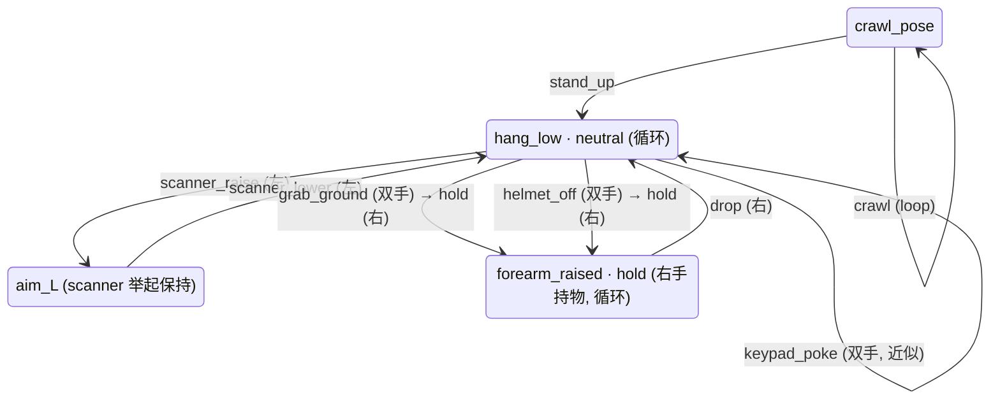

# 手臂动画状态机

第一人称手臂(`ArmsRig`)维护中动画 clip 的清单、每个 clip 的骨骼覆盖范围、起止状态假设与允许的衔接顺序。适用角色:技术美术(在 Blender 里制作与导出)、gameplay 程序(在 Unity 里驱动状态机与挂点)。

- 动画源文件:`SourceArt/Blender/ArmsRig/arms_rig_all.blend`(30 fps)。所有 clip 从这里导出。
- 场景里的 `REF_*`、`knife_dummy`、`Helmet_Placeholder`、`ScannerProp`(GameScanner)都是预览道具,不随 clip 导出;游戏内的手持物由 gameplay 侧在运行时挂到对应手部挂点。
- `GameScanner` 通过 CHILD_OF 约束锁在 `hand.L`,其物体级变换就是握持偏移——改任意一帧即全 clip 生效。

## 状态(pose)定义

| 状态 | 描述 | 手部位置(世界,米) |
|---|---|---|
| `hang_low`(neutral) | 手臂垂在身侧,手腕顺直 | 左 (0.22, 0, 1.05) / 右 (−0.22, 0, 1.05) |
| `forearm_raised` | 双前臂弯举在身前(= `relax` clip 的姿势) | 左 (0.31, −0.25, 1.52) / 右 (−0.31, −0.25, 1.52) |
| `aim_L` | 左前臂平举,scanner 指向正前方 | 左 (0.20, −0.32, 1.30) |
| `crawl_pose` | 爬行手位 | 左 (0.45, −0.13, 1.49) / 右 (−0.26, −0.53, 1.48) |

角色面朝 −Y;世界前方 = −Y。`forearm_raised` **不是** neutral;neutral 只有 `hang_low` 一个。

## 单手 clip(只含该侧手臂曲线,无 camera / root)

| clip | 帧 | 侧 | 起始假设 | 结束状态 |
|---|---|---|---|---|
| `scanner_raise` | 1–45 | 左 | `hang_low`,左手持 scanner | `aim_L` 平举保持(f17–45 为 hold) |
| `scanner_lower` | 1–17 | 左 | `aim_L`(= `scanner_raise` 末帧,逐值相等) | `hang_low`(= `scanner_raise` 首帧,逐值相等) |
| `hold` | 1–2 | 右 | `forearm_raised`,右手持物(= `grab_ground` 末帧右臂 / `drop` 首帧,逐值相等) | 同起始;循环。右前臂抬起的持物保持姿势 |
| `drop` | 1–28 | 右 | `forearm_raised`,右手持物(= `grab_ground` 末帧右臂,逐值相等);f4–7 张手松开,物体由 gameplay 侧解除挂点交给物理自由落体 | `hang_low`,右手空 |

单手 clip 在 Unity 里按手臂遮罩分层播放;另一侧手臂与 camera 不受影响。在 Blender 里预览时,未 key 的另一侧手臂显示的是文件的存储姿势(hang_low),不属于该 clip 的内容。

## 双手 clip(含 camera + root 曲线)

| clip | 帧 | 起始假设 | 结束状态 |
|---|---|---|---|
| `neutral` | 1–2 | `hang_low`,双手空 | 同起始;循环。这是唯一的 neutral,双前臂垂下 |
| `grab_ground` | 1–75 | `forearm_raised`,双手空(实测首帧 ±0.307, −0.246, 1.524) | `forearm_raised`,右手持物(蹲下抓取地面物品,f28 合拳;首末手位逐值相等) |
| `keypad_poke` | 1–50 | 双手低垂位(±0.30, −0.05, 1.15),双手空 | 同起始(首末相同;f25 右手戳向面前按键峰值) |
| `crawl` | 1–41 | `crawl_pose`,双手空;循环(首末相等) | `crawl_pose` |
| `stand_up` | 1–72 | `crawl_pose`,双手空(与 `crawl` 逐值衔接) | ⚠ **待返工**:实测末帧手位 (±0.660, 0.051, 2.716)、root.z = 2.876,既不是 `hang_low`,也把地面→站立的 1.410 m 抬升烘进了 root(见下方「高度基准」) |

## 衔接规则(状态机)



`neutral` 和 `hold` 是**循环 state**,不是"停在某个 clip 的最后一帧"。Unity 侧因此永远不需要
`Animator.speed = 0` —— 那会冻结所有层,是"调一个动画其它全停"的直接成因。
`hold` 在右臂遮罩层循环,所以右手持物时左臂仍可自由播 `scanner_raise`。

- `scanner_raise` 必须接 `scanner_lower` 回到 neutral,不允许从 hold 直接切别的左手动作。
- `drop` 只能从 `grab_ground` 的结束状态进入(起始帧逐值相等)。
- `crawl` 之后回到站立只能走 `stand_up`,结束即 neutral。

## 自带参考 clip(不在维护范围)

`knife_draw / knife_idle / knife_hit_01 / knife_hit_02`、`guard_draw / guard_idle`、`finger_gun_idle / finger_gun_fire / finger_gun_broken / finger_gun_fix`、`jab.L / jab.R`、`push.L / push.R`、`grab.L / grab.R`、`relax`、`rest`、`helmet_off` 随 rig 自带,起止假设不做维护。除 `helmet_off`(无 camera / root)外均含 camera + root 曲线。

## camera / root 覆盖一览(维护中 clip)

- **无** camera / root 曲线:`scanner_raise`、`scanner_lower`、`drop`、`hold`。
- **有** camera + root 曲线:`neutral`、`grab_ground`、`keypad_poke`、`crawl`、`stand_up`。

## 高度基准(地面动作 vs 站立动作)

所有 clip 在 Blender 内共用**同一高度基准**:rig 原点 = 站立地面,root 无整体高度位移。地面/站立的实际身体高度差不烘进动画,由 Unity 侧根据 player height + offset 设置 rig 挂点高度。

| 分类 | clip | Unity 侧挂点高度 |
|---|---|---|
| 站立(standing) | `neutral`、`hold`、`grab_ground`、`keypad_poke`、`scanner_raise`、`scanner_lower`、`drop` | 站立基准(clip 内的蹲下由动画自身表达) |
| 地面(ground) | `crawl` | 地面基准 = 站立基准 − (player height − offset) |
| 过渡(ground → standing) | `stand_up` | 播放期间由控制器把挂点从地面基准插值到站立基准;clip 本身无高度位移 |

分类以本表为唯一事实源;`Tools/blender/profiles/fps_arms.json` 只含 FBX 导出参数,不承载分类。

⚠ **实测偏差(2026-08-28)**:`stand_up` 违反上面这条基准。逐帧测得的 `root` 高度——

| clip | root.z 首帧 | 中段 | 末帧 |
|---|---|---|---|
| `grab_ground` / `keypad_poke` / `helmet_off` | 1.466 | 0.687(仅 grab_ground 的蹲下,属 clip 自身表达) | 1.466 |
| `crawl` | 1.458 | 1.458 | 1.458 |
| **`stand_up`** | 1.458 | 1.719 | **2.876** |

`crawl` 与站立基准只差 8 mm,符合契约;`stand_up` 末帧高出站立基准 1.410 m,即整段抬升被烘进了 clip。
Unity 侧若再按本表把挂点从地面基准插回站立基准,高度会叠加两次。修法与分期见
[手臂动画统一驱动 · 实施计划](../systems/手臂动画统一驱动_实施计划.md)。复现命令见该文 §7。

## 制作规约

- 新增或修改任何含 `handIK` 的 clip,提交前必须通过手腕检查:

  ```bash
  /Applications/Blender.app/Contents/MacOS/Blender --background \
    SourceArt/Blender/ArmsRig/arms_rig_all.blend \
    --python Tools/blender/validate_wrist.py -- \
    --armature ArmsRig --joints forearm.R:hand.R,forearm.L:hand.L \
    --max-twist 90 --max-swing 85
  ```

- 成对/衔接的 clip(raise↔lower、grab_ground→drop、crawl→stand_up)在接缝帧必须逐值相等,不允许"看起来差不多"。
- 单手 clip 不得混入另一侧手臂、camera 或 root 的曲线。
- 保存文件前把未 key 的存储姿势归位到 `hang_low`(双手垂下、手指 relax 卷曲),避免导出烘焙时带入串台姿势(validate_wrist 按"文件保存状态"评估,能抓到这一类污染)。

## 待定项

- **`grab_ground` 首帧离 neutral 0.54 m**:首帧是 `forearm_raised`(±0.307, −0.246, 1.524),neutral 是 (±0.22, 0, 1.05)。目前由 0.25 s 的 cross-fade 盖过去,不是逐值衔接。若要严格符合"成对 clip 接缝逐值相等",技术美术需把 `grab_ground` 开头几帧改成从 `hang_low` 起手。
- **`helmet_off` 末帧**:实测 (±0.200, 0.009, 1.191),既不是 `hang_low` 也不是 `forearm_raised`;末帧到 `hold` 之间有约 0.33 m 由 cross-fade 承担。头盔在 **f27** 被右手抓住(`helmet_socket` 与 `hand.R` 的距离自 f27 起恒为 0.237 m),f37 起离开头顶——Unity 侧的 Attach 事件就取 f27。
- **`keypad_poke`** 的起止手位与 `hang_low` 相差约 10 cm,同样由 cross-fade 承担;是否统一到 `hang_low` 待定。
- **`crawl` 没有入口**:没有任何 clip 从站立进入 `crawl_pose`,所以 Unity 侧对 `crawl` 关掉了姿势闸门。补一条"趴下"clip 后即可打开。
