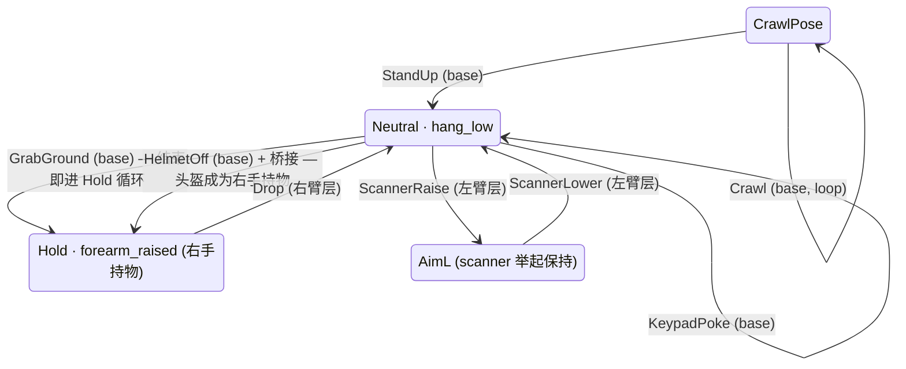

# 手臂动画统一驱动 —— 实施计划

> **目标**：把现在"一个 clip 一个组件、各自抢 Animator"的散装接线，收敛成**一个驱动器 + 一张可调表**。加一个动画 = 加一行数据，不再是加一个组件；调一个动画不会让其它动画停摆。
> **适用角色**：gameplay 程序（驱动器、状态机、挂点）、技术美术（Blender clip、导出、遮罩）。
> **上层规范**：[手臂动画状态机契约](../contracts/手臂动画状态机.md)（clip 的骨骼覆盖与起止假设）、[表现层驱动契约](../contracts/表现层驱动契约.md)（View 接口边界）、[Blender → Unity 导出管线](../tooling/Blender到Unity导出管线.md)。
> **状态**：阶段 0–3 已落地并验证（见 §8 进度），阶段 4–6 待做 · 本文列出的所有"实测"数字均可用文中给出的命令复现。

---

## 1. 现状与问题（实测）

### 1.1 Unity 侧：没有状态机，只有六个孤立 state

`Assets/RootsDance/Animations/Controllers/PlayerArms.controller` 只有一个 Base Layer，
六个互不相连的 state（`Crawl` / `StandUp` / `HelmetOff` / `ScannerRaise` / `ScannerLower` / `KeypadPoke`），
**零 parameter、零 transition、零 layer、零 AvatarMask**（`find Assets/RootsDance -name '*.mask'` 为空）。

驱动方全是各写各的：

| 组件 | 做法 | 副作用 |
|---|---|---|
| `HelmetAnimatorView.Awake` | `Play("HelmetOff", 0, 0f)` + `animator.speed = 0` | **全局**冻结 Animator，所有层一起停 |
| `ArmsClipDebugTrigger` | 播完 `Play(idleState)` + `animator.speed = 0` | 同上；且 idle 是 `HelmetOff` 首帧，不是 neutral |
| `CrawlDebugTrigger` | 自己一套 toggle + `speed = 0` | 同上 |
| `ScannerAnimatorView` | `Play(state, m_layer, 0)`，`m_layer` 默认 0 | 单臂 clip 播在 base layer 上，直接盖掉另一只手 |

这就是"给一个动画做测试，其它动画就不动了"的直接成因：**四个组件同时是 Animator 的所有者，且其中三个会把全局 speed 归零。**

### 1.2 缺失的 clip

`SourceArt/Blender/ArmsRig/arms_rig_all.blend` 里已有、但**没有导出到 Unity**的动作：

- `grab_ground`（1–75，双手 + camera + root）
- `drop`（1–28，右臂）

`Assets/RootsDance/Meshes/Characters/` 目前只有 `Arms / Arms_Crawl / Arms_KeypadPoke / Arms_ScannerRaise / Arms_ScannerLower / Arms_StandUp`。

**完全不存在的动作**：

- **neutral 静止**：`hang_low`（双臂垂下）没有任何 clip。现在 Unity 用 `HelmetOff` 首帧当 idle，而 `helmet_off` 首帧是 `forearm_raised`（0.307, −0.246, 1.504）——**这就是"neutral 现在是 rest 而不是双前臂下垂"的来源**。
- **hold 保持**：右手持物停在 `forearm_raised` 的循环 clip 没有。`grab_ground` 播完停最后一帧，一旦有任何其它 state 抢走右臂就掉姿势。
  现成可用的素材是 rig 自带的 `relax`（1–60，双臂 `forearm_raised` 循环，首末相等），**用右臂遮罩层播它就是 hold**。

### 1.3 高度基准：`stand_up` 把地面→站立的抬升烘进了 root

契约写的是"所有 clip 共用同一高度基准，root 无整体高度位移，地面/站立高度差由 Unity 侧挂点承担"。实测（复现命令见 §7）：

| clip | root.z 首帧 | root.z 中段 | root.z 末帧 |
|---|---|---|---|
| `grab_ground` | 1.466 | 0.687（蹲下，clip 自身表达，符合契约） | 1.466 |
| `keypad_poke` | 1.466 | 1.466 | 1.466 |
| `helmet_off` | 1.466 | 1.466 | 1.466 |
| `crawl` | 1.458 | 1.458 | 1.458 |
| **`stand_up`** | **1.458** | 1.719 | **2.876** |

`stand_up` 结束时 root 比站立基准（1.466）高 **1.410 m**，手也停在 z = 2.716（`hang_low` 应为 1.050）。
即：**这一条 clip 单独把整段"从地上站起来"的高度烘进了 root**。Unity 侧如果按契约再把挂点从地面基准插值回站立基准，高度会被叠加两次，视角直接飞到 1.4 m 以上。

`crawl` 的 root（1.458）和站立基准（1.466）只差 8 mm，说明 crawl **没有**烘进俯卧高度——crawl 一侧符合契约，`stand_up` 一侧不符合。二者必须统一。

### 1.4 契约与资产漂移（三处）

| 契约当前写法 | 实测 | 结论 |
|---|---|---|
| `grab_ground` 起始假设 `hang_low` | 首帧 = 末帧 = `forearm_raised`（0.307, −0.246, 1.524） | 契约行过时；`grab_ground` 是从 hold 姿势下蹲取物再回到 hold 的闭环 |
| `stand_up` 结束状态 `hang_low` | 末帧 (±0.660, 0.051, 2.716)，root 2.876 | 见 §1.3，clip 需返工 |
| `helmet_off` 不做维护 | 首帧 `forearm_raised`(1.504) → 末帧 (±0.200, 0.009, 1.191) | 末帧既不是 `hang_low` 也不是 `forearm_raised`，需要一段桥接或改末帧 |

### 1.5 scanner 在 Unity 里放大约 100 倍 —— 根因已定位

**不是导出管线的问题。** 逐层实测：

- `Scanner.blend` 里 `Body` 尺寸 (0.181, 0.062, 0.313) m，`scale_length = 1.0`，物体 scale 全 1；
- `Scanner.fbx` 反向导回 Blender 得到同样的 (0.181, 0.062, 0.313)；
- Unity 里 `Scanner.fbx` 的 `fileScale = 0.01`、节点 `localScale = 100`，实例根 scale = 1，**世界包围盒 (0.229, 0.335, 0.063) m —— 正确**；
- `Scanner.prefab` 单独实例化，包围盒同样正确。

问题出在 `ScannerHandSocket.LateUpdate` 的最后一行：

```csharp
transform.localScale = m_holdWorldScale;   // 字段名是 world，赋的是 local
```

场景 `PlayerTest_Gameplay.unity` 里，`Scanner` prefab 实例的父节点是 **Arms.fbx 模型实例内部的节点**（`m_TransformParent` 指向 guid `ec496eb6…` = `Arms.fbx`）。
该模型内部每个节点的 `lossyScale ≈ 100`（`hand.L` 实测 lossy = (64.0, 100.2, 114.4)）。
于是 scanner 的实际世界缩放 = 父级 lossy(≈100) × 0.670016 ≈ **67**，而不是期望的 0.67 —— 约百倍，与观察一致。

同一行还解释了"Unity 与 Blender 相对大小不一致"：`m_holdWorldScale = 0.670016` 本身是技术美术在 Blender 里把 `GameScanner` 副本缩到 0.67 以适配手掌的结果（`Scanner.blend` 的 `Body` 高 0.313 m，rig 里的副本高 0.209 m，比值 0.6698）。**这个 0.67 是道具的成品尺寸，不该由挂点组件来施加。**

---

## 2. 设计：一个驱动器 + 一张表

### 2.1 唯一所有者

**只有 `ArmsDirector` 持有 `Animator`。** 其它任何组件都不再调 `Animator.Play` / 不再写 `Animator.speed`。
`animator.speed` 永远保持 1；"停住"由**真实的循环 state**（Neutral / Hold）表达，不由冻结表达。

```csharp
namespace RootsDance.Player.Arms
{
    public interface IArmsDirector
    {
        ArmsPose LeftPose  { get; }
        ArmsPose RightPose { get; }

        bool IsBusy(ArmsScope scope);

        /// <summary>按 id 请求一个动作；姿势闸门不通过时返回 false 并记一条 warning，不播。</summary>
        bool TryPlay(string actionId);

        /// <summary>播完（或被打断）后回调，带 id。表现层→gameplay 的唯一回程。</summary>
        event Action<string> ActionFinished;
    }
}
```

现有 `IScannerView` / `IHelmetView` / `IToolView`（[表现层驱动契约](../contracts/表现层驱动契约.md) D17）**保持不变**，改为薄适配器转调 `IArmsDirector`。
`ScannerInspectController`、`HelmetController`、`ToolUseController` 一行不改。

### 2.2 三层 + 两个遮罩

| layer | 遮罩 | 内容 | 默认权重 |
|---|---|---|---|
| 0 `Base` | 无 | 双手 clip：`Neutral`（循环 `hang_low`）、`GrabGround`、`KeypadPoke`、`Crawl`、`StandUp`、`HelmetOff` | 1 |
| 1 `LeftArm` | `ArmLeft.mask` = `ArmsRig/root/shoulder.L` 子树 + `ArmsRig/handIK.L` | `ScannerRaise`、`ScannerLower`、`Empty` | 0（播左臂动作时升到 1） |
| 2 `RightArm` | `ArmRight.mask` = `ArmsRig/root/shoulder.R` 子树 + `ArmsRig/handIK.R` | `Drop`、`Hold`（右臂遮罩下的 `relax` 循环）、`Empty` | 0 |

遮罩资产落在 `Assets/RootsDance/Animations/Masks/`，由 §3 的 builder 生成，不手写。

**不建 transition 图。** 驱动器用 `Animator.CrossFadeInFixedTime(stateHash, fadeIn, layer)` 直接切；
过渡时长写在数据里（每个动作一个 `m_fadeIn` / `m_fadeOut`），而不是画在 controller 里 —— 这样"可调的东西"只有一个地方。

### 2.3 数据：`ArmsActionSO`，一个 clip 一张资产

落在 `Assets/RootsDance/Data/Arms/Actions/`。这是技术美术和 gameplay 程序**唯一**需要调的面板。

```csharp
public enum ArmsPose  { HangLow, ForearmRaised, AimL, CrawlPose }   // 契约 §状态(pose)定义
public enum ArmsScope { Both, Left, Right }
public enum ArmsHeightBase { Standing, Ground, GroundToStanding }
public enum HandEventKind  { Attach, Detach }
```

| TitleGroup | 字段 | 说明 |
|---|---|---|
| Basic Info | `m_id` / `m_stateName` / `m_clip` / `m_scope` / `m_loop` | id 是 gameplay 唯一引用的字符串；`m_scope` 决定落在哪一层 |
| Interaction | `m_requiredPose` / `m_resultPose` | 姿势闸门。契约表直接翻译过来，代码来守 |
| Conditions | `m_heightBase` / `m_heightCurve` | 见 §2.5 |
| Result | `m_handEvents[]` = `{ m_normalizedTime, m_hand, m_kind, m_socketBone }` | 见 §2.4 |
| Tuning | `m_speed` / `m_fadeIn` / `m_fadeOut` / `m_debugKey` | 手感调参；builder 不覆盖 |

`ArmsActionSetSO`（`Assets/RootsDance/Data/Arms/PlayerArmsActions.asset`）持有全部 `ArmsActionSO` 的列表，
用 Odin `[TableList]` 呈现，加一个 `[Button("Rebuild Controller")]`。**这一张表就是"统一调参界面"。**

> 按 [guideline 12](../../guidelines/12-odin-inspector.md)：只用 `Sirenix.OdinInspector` 特性装饰 `[SerializeField] private` 字段，
> 不用 `SerializedScriptableObject`，`[Required]` 挂每个引用，`[ValidateInput]` 校验 id 唯一。

### 2.4 手上的东西：`HandSocket` + `CarriedItem`

`ScannerHandSocket` 泛化为 `HandSocket`，一只手一个，挂在**不在模型层级内**的空节点上
（`Player/Arms/Sockets/HandL`、`.../HandR`），跟随 `hand.L` / `hand.R` 的世界位置与旋转。

两处必须改：

1. **缩放**（修 §1.5 的百倍 bug）。挂点不再施加任何缩放：

   ```csharp
   // HandSocket 只跟位置和旋转；被握物体的成品尺寸由它自己的 prefab 决定。
   transform.SetPositionAndRotation(
       m_handBone.position + m_handBone.rotation * m_holdPositionOffset,
       m_handBone.rotation * m_holdRotationOffset);
   ```

   前提是挂点节点的父级无缩放（把 sockets 移出 `Arms.fbx` 实例层级即可做到）。
   `0.670016` 这个"在手里的成品比例"回到它该在的地方：**在 Blender 里对 `Scanner.blend` 应用 0.67 缩放并重导**，
   Unity 侧 scanner 就是 1:1，不再有任何一处代码知道这个数。
   过渡期若不想动美术源文件，退而求其次把 0.67 写进 `Scanner.prefab` 根节点的 `localScale`，仍然不写进挂点组件。

2. **抓/放**。`HandSocket` 提供 `Attach(CarriedItem)` / `Detach()`：
   - `Attach` —— 关掉 `Rigidbody`（`isKinematic = true`）、关碰撞体、把物体设为挂点子物体、清零 local TRS；
   - `Detach` —— 反过来，并把挂点这一帧的速度传给 `Rigidbody.linearVelocity`，物体自由落体。

`CarriedItem` 是被握物体上的组件，记 `m_hand`（左/右）、`m_gripPosition` / `m_gripRotation`（相对挂点的握持偏移）。
Scanner、Helmet、后续所有手持物共用它。

**触发时机不写死在代码里，也不用导入 clip 上的 Animation Event**（后者每次重导都要重挂，脆弱）。
`ArmsDirector` 每帧比对当前 state 的 `normalizedTime` 与 `m_handEvents[i].m_normalizedTime`，跨过阈值就触发一次，
一次播放内每个事件只触发一次。契约里已经写好的时点直接填进去：

| 动作 | 事件 | `m_normalizedTime` | 依据 |
|---|---|---|---|
| `grab_ground` | 右手 `Attach` | 28 / 75 ≈ **0.373** | 契约"f28 合拳" |
| `drop` | 右手 `Detach` | 5.5 / 28 ≈ **0.196** | 契约"f4–7 张手松开" |
| `helmet_off` | 右手 `Attach`（头盔变手持物） | 待定，见 §4 步骤 3 | 由技术美术在 `helmet_socket` 脱手那一帧给出 |

### 2.5 高度差：`ArmsHeightRig`

高度只有一个所有者：`ArmsHeightRig` 写 arms 根节点的 local Y。
`ArmsViewOffset` 继续负责**取景**（anchor + per-clip correction + taste），两者相加，职责不重叠。

```
Standing          → m_standingLocalY
Ground            → m_standingLocalY − (m_playerHeight − m_groundOffset)
GroundToStanding  → 按 m_heightCurve 在动作时长内从 Ground 插到 Standing
```

`m_playerHeight` / `m_groundOffset` 是两个 `[SerializeField]` 数字，放在同一个组件上，一处可调。

**前置条件**：`stand_up` 的 root 抬升（§1.3）必须先在 Blender 里去掉，否则高度会叠两次。
两个选项，推荐前者：

- **A（推荐）** 技术美术把 `stand_up` 的 root 高度曲线压平到 1.466，让 clip 只表达姿势变化，Unity 独占高度 —— 与契约一致，且 `crawl` 已经是这个做法。
- **B（兜底）** 在 `ArmsActionSO` 上加一条"每 clip root 高度补偿曲线"由驱动器反向抵消 —— 能救急，但从此有两个地方决定高度，正是要消灭的东西。

### 2.6 状态机与 hold



- **`Hold` 是一个真实的循环 state**（右臂遮罩层上的 `relax`），不是"停在 `GrabGround` 最后一帧"。
  这样右手保持持物姿势的同时，左臂层仍可自由播 `ScannerRaise`——手里拿着东西也能举扫描仪。
- **Neutral 是循环的 `hang_low`**，不是任何 clip 的冻结帧。
- `TryPlay` 的闸门：请求动作的 `m_requiredPose` 与当前该 scope 的姿势不符 → 拒绝 + `Log.Warning`，不静默播错。

---

## 3. Editor 工具：`ArmsControllerBuilder`

`Assets/RootsDance/Scripts/Editor/Tools/ArmsControllerBuilder.cs`，菜单 `RootsDance > Build Arms Controller`。
输入 `ArmsActionSetSO`，输出：

1. 三层 `PlayerArms.controller`（层、遮罩、每个动作一个 state、每层一个 `Empty`）；
2. `Assets/RootsDance/Animations/Masks/ArmLeft.mask` / `ArmRight.mask`；
3. 每个 state 的 speed multiplier 参数接线；
4. 刷新 `ArmsViewOffset.Clips` 的 machine-derived 字段（沿用现有 `ArmsFramingBuilder` 的"保留 `m_tweak`"约定）。

**加一个动画的完整流程从此是**：Blender 里做 clip → 导出 FBX（§7 命令）→ 新建一个 `ArmsActionSO` 填表 → 点 `Rebuild Controller`。
不写代码、不碰 controller YAML（[非协商条款 16](../../AGENTS.md)：不手改 `.controller`）。

`ArmsDebugConsole` 取代现有三个 debug trigger：从同一个 `ArmsActionSetSO` 读 `m_debugKey`，
全部动作同时可按，且因为没有任何一处冻结 Animator，测一个不会让别的停摆。

---

## 4. 分期与验收

### 阶段 0 · 校正契约（gameplay 程序 + 技术美术，半天）

1. 用 §7 的命令复跑 §1.3 / §1.4 的测量，两人一起确认数字；
2. 更新 [手臂动画状态机契约](../contracts/手臂动画状态机.md)：`grab_ground` 起始姿势改为 `forearm_raised`；`stand_up` 与 `helmet_off` 的末帧记为待返工；
3. 把 §1.5 的结论写进 [Blender → Unity 导出管线](../tooling/Blender到Unity导出管线.md) 的挂点一节。

**验收**：契约表的每一行都能被一条命令复现。

### 阶段 1 · 补齐 clip（技术美术）

| 任务 | 产出 |
|---|---|
| 导出 `grab_ground` | `Assets/RootsDance/Meshes/Characters/Arms_GrabGround.fbx` |
| 导出 `drop` | `Arms_Drop.fbx` |
| 新建 `neutral` 动作（2 帧，`hang_low`，双臂垂下、手指 relax） | `Arms_Neutral.fbx`，loop |
| 导出 `relax` 作 hold 循环 | `Arms_Hold.fbx`，loop |
| 压平 `stand_up` 的 root 高度曲线（§2.5 选项 A） | 重导 `Arms_StandUp.fbx` |
| 给出 `helmet_off` 里头盔脱手的帧号；末帧姿势并到 `forearm_raised` 或另加桥接 | 重导 `Arms.fbx` + 帧号 |
| 每个改动过 `handIK` 的 clip 跑腕部校验 | `validate_wrist.py` 通过 |
| 存盘前把未 key 的存储姿势归位到 `hang_low` | 契约"制作规约"最后一条 |

同步在 `Tools/unity/model_import_profiles.json` 的 `m_assets` 里补对应条目（`m_clipName` / `m_loopTime`）。

**验收**：六个新 FBX 在 Unity 里 import 无警告；`Arms_Neutral` 首帧手位 = (±0.220, 0.000, 1.050)（契约 `hang_low`）。

### 阶段 2 · 遮罩与 controller builder（gameplay 程序，1 天）

产出 `ArmsActionSO` / `ArmsActionSetSO` / `ArmsControllerBuilder` / 两个 `.mask`。

**验收**：删掉 `PlayerArms.controller` 后点一次 `Rebuild Controller` 能完全重建；三层结构、遮罩正确。

### 阶段 3 · 驱动器（gameplay 程序，1–2 天）

产出 `ArmsDirector` / `IArmsDirector` / `ArmsPose` 等枚举 / `ArmsDebugConsole`。
删除 `ArmsClipDebugTrigger`、`CrawlDebugTrigger`、`HelmetDebugTrigger` 里的 Animator 直驱与 `speed = 0`。

**验收**：`ArmsDebugConsole` 里逐个按键播完所有动作，任意顺序，Animator 不冻结，姿势闸门按契约拒绝非法衔接（Console 有 warning，无异常）。

### 阶段 4 · 手持物（gameplay 程序 + 技术美术，1 天）

产出 `HandSocket` / `CarriedItem`；`ScannerHandSocket` 并入 `HandSocket` 后删除。
把 sockets 移出 `Arms.fbx` 实例层级。修 scanner 尺寸（§2.4 首选：Blender 里应用 0.67 并重导）。
`HelmetAnimatorView` 不再 `m_helmetRenderer.enabled = false`，改为 `helmet_off` 的 `Attach` 事件把 `Helmet.prefab` 交给右手挂点，随后 base 层进 `Hold`。

**验收**：
- scanner 在手里的世界包围盒高度 ≈ 0.22 m（现在 ≈ 22 m：0.335 m × 父级 lossy 100 × 0.670016）；
- 摘下头盔后头盔是右手持物，按 `Drop` 能扔到地上并有物理落地；
- `grab_ground` 在 f28 合拳那一帧物体入手，`drop` 在 f4–7 之间脱手。

### 阶段 5 · 高度（gameplay 程序，半天）

产出 `ArmsHeightRig`。`crawl` → `stand_up` → 站立全程视高连续，无跳变、无双倍抬升。

**验收**：Play 模式下 crawl 时相机高度 = 站立高 − (player height − offset)，`stand_up` 播完回到站立高，误差 < 1 cm。

### 阶段 6 · 接口适配与测试（gameplay 程序，半天）

`ScannerAnimatorView` / `HelmetAnimatorView` 改为 `IArmsDirector` 的薄适配器，接口签名不变。
EditMode 测试（纯 C#，[guideline 08](../../guidelines/08-testing-tooling.md)）：

- `TryPlay_RequiredPoseMismatch_ReturnsFalse`
- `TryPlay_LeftActionWhileRightBusy_Succeeds`（分层不互斥）
- `HandEvents_FiredOnceInOrder_WhenNormalizedTimeCrossesThreshold`
- `ResolveHeight_GroundToStanding_InterpolatesBetweenBases`

---

## 5. 变更清单

**新增**

```
Assets/RootsDance/Scripts/Runtime/Player/Arms/
  ArmsPose.cs  ArmsScope.cs  ArmsHeightBase.cs  HandEventKind.cs
  ArmsActionSO.cs  ArmsActionSetSO.cs
  IArmsDirector.cs  ArmsDirector.cs
  ArmsHeightRig.cs  ArmsDebugConsole.cs
Assets/RootsDance/Scripts/Runtime/Interaction/HandSocket.cs
Assets/RootsDance/Scripts/Runtime/Interaction/CarriedItem.cs
Assets/RootsDance/Scripts/Editor/Tools/ArmsControllerBuilder.cs
Assets/RootsDance/Data/Arms/PlayerArmsActions.asset + Actions/*.asset
Assets/RootsDance/Animations/Masks/ArmLeft.mask, ArmRight.mask
Assets/RootsDance/Meshes/Characters/Arms_GrabGround|Drop|Neutral|Hold.fbx
Assets/RootsDance/Tests/EditMode/Arms/ArmsDirectorTests.cs
```

**改**：`PlayerArms.controller`（由 builder 重建）、`Arms.fbx` / `Arms_StandUp.fbx`（重导）、
`Scanner.blend` + `Scanner.fbx`（应用 0.67）、`ScannerAnimatorView`、`HelmetAnimatorView`、
`ArmsViewOffset`（只留取景职责）、`model_import_profiles.json`、`PlayerTest_Gameplay.unity`（sockets 移出模型层级）。

**删**：`ScannerHandSocket.cs`、`ArmsClipDebugTrigger.cs`、`CrawlDebugTrigger.cs`、`HelmetDebugTrigger.cs`。

---

## 6. 风险

| 风险 | 处理 |
|---|---|
| `stand_up` 返工需要技术美术重做 root 曲线 | 阶段 5 前可先用 §2.5 选项 B 兜底，不阻塞其它阶段 |
| 遮罩层与 camera / root 曲线冲突：单臂 clip 无 camera/root，双手 clip 有 | 遮罩里排除 `root` 与 `camera`，只有 base 层能动它们（契约"camera / root 覆盖一览"） |
| `helmet_off` 末帧不在任何已定义姿势上 | 阶段 1 由技术美术并到 `forearm_raised`；并入前 `HelmetOff` 之后强制走 base 层 `Hold`，用 `m_fadeIn` 盖过差值 |
| 场景手工接线（sockets 移出层级）会动 `PlayerTest_Gameplay.unity` | [guideline 11](../../guidelines/11-scenes-prefabs-workflow.md)：改前在团队频道说一声；改动集中在一次提交 |

---

## 7. 复现命令

**导出一个动作**（在仓库根运行）：

```bash
/Applications/Blender.app/Contents/MacOS/Blender --background \
  SourceArt/Blender/ArmsRig/arms_rig_all.blend \
  --python Tools/blender/export_fbx.py -- \
  --project-root . \
  --output Assets/RootsDance/Meshes/Characters/Arms_GrabGround.fbx \
  --objects ArmsMesh,ArmsRig \
  --armature ArmsRig \
  --action grab_ground \
  --profile Tools/blender/profiles/fps_arms.json \
  --manifest SourceArt/Export/Arms_GrabGround.export.json
```

**测量 root / camera / 手位**（§1.3、§1.4 的数字）——脚本写到仓库外的临时目录：

```bash
/Applications/Blender.app/Contents/MacOS/Blender --background \
  SourceArt/Blender/ArmsRig/arms_rig_all.blend --python /tmp/root.py
```

```python
# /tmp/root.py
import bpy
arm = bpy.data.objects['ArmsRig']
if arm.animation_data is None:
    arm.animation_data_create()

def sample(f, bones):
    bpy.context.scene.frame_set(int(f))
    ev = arm.evaluated_get(bpy.context.evaluated_depsgraph_get())
    return {b: tuple(ev.matrix_world @ ev.pose.bones[b].head)
            for b in bones if b in ev.pose.bones}

for n in ["crawl", "stand_up", "grab_ground", "keypad_poke", "helmet_off"]:
    act = bpy.data.actions.get(n)
    if act is None:
        continue
    arm.animation_data.action = act
    f0, f1 = act.frame_range
    for f in [f0, (f0 + f1) // 2, f1]:
        print(n, int(f), sample(f, ["root", "camera", "hand.L", "hand.R"]))
```

**核对 Unity 侧的实际尺寸与父级缩放**（Editor 打开时，[Unity CLI 流程](../tooling/unity-cli-agent-workflow.md)）：

```bash
~/.unity/bin/unity --no-banner --json command eval --code 'var go = UnityEditor.AssetDatabase.LoadAssetAtPath<GameObject>("Assets/RootsDance/Prefabs/Props/Scanner.prefab"); var i = (GameObject)UnityEditor.PrefabUtility.InstantiatePrefab(go); var b = new Bounds(); bool h = false; foreach (var r in i.GetComponentsInChildren<Renderer>(true)) { if (!h) { b = r.bounds; h = true; } else b.Encapsulate(r.bounds); } var s = b.size.ToString("F4"); UnityEngine.Object.DestroyImmediate(i); return s;'
```

**腕部校验**（任何改过 `handIK` 的 clip 提交前必跑）：

```bash
/Applications/Blender.app/Contents/MacOS/Blender --background \
  SourceArt/Blender/ArmsRig/arms_rig_all.blend \
  --python Tools/blender/validate_wrist.py -- \
  --armature ArmsRig --joints forearm.R:hand.R,forearm.L:hand.L \
  --max-twist 90 --max-swing 85
```


---

## 8. 进度（2026-08-28）

### 已落地并验证

**Blender 侧** —— `arms_rig_all.blend` 新增两条动作，并把四条既有动作的首末帧对齐到契约姿势。

| 新动作 | 帧 | 来源 | 用途 |
|---|---|---|---|
| `neutral` | 1–2，循环 | 左臂 ← `scanner_lower` f17；右臂 ← `drop` f28；root/camera 归位站立基准 | 唯一的 neutral：双前臂垂下 |
| `hold` | 1–2，循环，仅右臂 | ← `drop` f1（≡ `grab_ground` f75） | 取物与丢弃之间的持物保持，右前臂抬起 |

| 修改的动作 | 改动 |
|---|---|
| `grab_ground` | 首帧由 `forearm_raised` 改为 `hang_low`（f1→f8 过渡），末帧左臂归 `hang_low`（右臂原本已等于 hold） |
| `helmet_off` | 首帧改为 `hang_low`，末帧左臂 `hang_low` / 右臂 hold 姿势 |
| `keypad_poke` | 首末帧由 (±0.30, −0.05, 1.15) 改为 `hang_low` |
| `stand_up` | 末帧改为 `hang_low`；`root.location[1]` 的 1.418 m 抬升线性压平到 0，高度交还 `ArmsHeightRig` |

**验收**：以世界骨骼矩阵（该侧全部骨骼）比较，**18/18 接缝精确**，最大偏差 ≤ 1e-6。
不再有任何一处靠 cross-fade 掩盖的接缝。`validate_wrist.py`：28 个 action 全清。
四元数改动后统一做了符号对齐，避免相邻帧走远路旋转。

> 复现：`Tools/` 下没有落这套脚本——它们是一次性的改帧操作，做法与验收记录在本节；
> 验收本身可以用 §7 的测量脚本重跑。

**scanner 尺寸** —— `Scanner.blend` 整体缩放 0.670016 并 apply（原点在握把底部，缩放前后不变），
重导后 Unity 里就是握在手里的成品尺寸；`Scanner.prefab` 的 `ScreenAnchor` 位于 (0,0,0)、
屏幕画布是它的子物体，全部按比例跟随，不需要重建。

**导出** —— 十条 arms clip 全部重导并在 `model_import_profiles.json` 注册。

**Unity 侧** —— 三层遮罩状态机由 `RootsDance > Arms > Build Arms Controller` 生成；
`ArmsDirector` 是 Animator 的唯一持有者，`Animator.speed` 恒为 1；
neutral 与 hold 是真实循环 state。姿势闸门与高度基准有 16 个 EditMode 测试覆盖。
`HandSocket` 不写缩放，`CarriedItem` 承担成品尺寸与握持偏移。
`HelmetArmsView` 把 `IHelmetView` 接到驱动器上：在 f27 的 Attach 事件隐藏 clip 自带的头盔、
把真头盔交给右手挂点，随后进入 `hold`——从此头盔就是普通手持物，`drop` 能照常扔掉它。

### 接线（一条菜单命令）

场景接线做成了幂等的 Editor 工具而不是直接改场景文件：
`RootsDance > Arms > Wire Player Arms Rig`。它做四件事——

1. 在手臂上方插入 `ArmsHeightAnchor`（`ArmsHeightRig` 需要独立的 transform：
   `ArmsViewOffset` 已经在写手臂的 local position，取景和身体高度是两个不同的决定）；
2. 挂 `ArmsDirector` / `ArmsDebugConsole` / `HelmetArmsView` 并接好引用；
3. 在**模型层级之外**建 `HandSocket_L` / `HandSocket_R`，跟随 `hand.L` / `hand.R`；
4. 移除被取代的组件（`ArmsClipDebugTrigger`、`CrawlDebugTrigger`、`HelmetDebugTrigger`、
   `ScannerHandSocket`）。

工具**不保存场景**——跑完先看，再决定保存还是还原。

### 仍待做

1. **scanner 适配器**：`ScannerArmsView` 实现 `RootsDance.Scanner.IScannerView`，而整个
   `Scanner` 命名空间目前还是未提交的在制品，所以它留在工作区、不在本分支跟踪，
   随 scanner 功能一起提交。同时 `ScannerAnimatorView` / `ScannerHandSocket` 可以删掉。
2. **`ScannerPreviewSlot` 等仍引用旧挂点的地方**随 scanner 提交一并清理。
3. **`crawl` 没有入口**：没有"趴下"clip，所以 `crawl` 的姿势闸门是关的；补上后打开。
4. **手感调参**：`m_speed` / `m_fadeIn` / `m_fadeOut` / 手部事件时点都在
   `Assets/RootsDance/Data/Arms/Actions/` 的十张资产里，试玩后直接改，不用碰代码。
