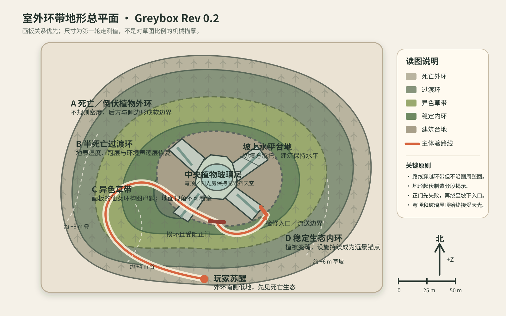
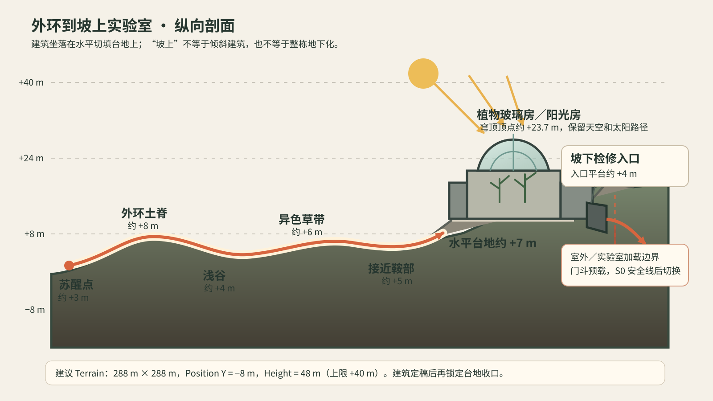

# 《Where the Roots Dance》00章前段环境设计

> 范围: 玩家苏醒起始点至异色草带近侧边缘，止于玩家跨入草带之前  
> 文档类型: Environment Design  
> 版本: Draft 0.5  
> 日期: 2026-08-28

## 1. 设计目标

本段要让玩家不依赖任务箭头，仅通过地形、遮挡、光色、植被状态和人造遗迹，自然完成一次从“被污染区困住”到“主动接近异常生命”的心理转变。

环境叙事的核心不是展示灾难规模，而是让玩家逐步读懂三件事:

1. 这里曾被人类以理性的隔离和调查手段控制。
2. 这套控制已经失效，但污染并非均匀存在。
3. 前方出现了一种不符合外部死亡状态的稳定生命，值得接近和调查。

体验曲线为:

`南侧低地苏醒 → 从地形缺口爬上外环土脊 → 下到调查浅谷 → 顺回升地势察觉生态恢复 → 看见异色草带 → 停在边界前产生进入欲望`

## 2. 已定依据与本稿设计决定

### 2.1 已实现地形是本稿的空间硬约束

本稿不另造一条独立场景路线，而是在[全章节地形与场景空间设计方案](./全章节地形与场景空间设计方案.md)已经落入 Unity 的 Terrain 上完成环境设计。以下关系不能因美术摆放而被改写:

- 玩家从南侧死亡外环的低地苏醒，中央设施位于多层不规则生态环的内核。
- 主路线先向西侧弯折，爬上外环土脊，再落入过渡浅谷，之后回转向内并爬上异色草坡。
- 路线是切过环带的弧形路径，不沿完整圆周行走，也不从苏醒点直线冲向中央设施。
- 苏醒低地、外环土脊、过渡浅谷和异色草坡已经形成连续高低关系。环境物件必须顺着现有坡形与弯道组织，不能用围栏或营地把它重新读成平坦走廊。
- 当前灰盒缺少正式雾、植被与遮挡物，因此从部分高点可能过早看到实验室。最终环境设计必须让土脊、死树群和雾层继续遮挡中央设施，保持“先见草带，后见建筑”的既定揭示顺序。
- 总平面中的路线只表示玩家体验流向，不代表地面上存在一条可见道路。Unity 里现有的可通行地形只提供坡度和宽度基础，正式画面必须用侵蚀、腐殖物、碎石、根系、枯枝和不连续植被打散其表面，使它无法被读成完整路基或踩踏小径。
- 玩家需要判断的是下一处可进入的地形缺口，而不是追踪一条地表色带。倒木、围栏、路障和营地可以帮助判断空间，但不能沿动线两侧持续排列，也不能共同勾勒出道路边缘。

### 2.2 美术与策划资料已明确

- 视觉方向为“低模半写实 PSX × 九十年代生态科研复古未来主义”。
- 开场污染区包含黄灰浓雾、铁丝网、倒伏枯木和水泥路障，整体压抑、死寂、低能见度。
- 环境变化必须连续。污染区之后雾逐渐变薄，蕨类和零星树木开始出现，最后才抵达异色草带。
- 异色草带应成为自然的远景目标，不表现成任务结界、人工围墙或魔法边界。
- 当前室外宏观空间采用不规则生态环。玩家从南侧外环低地苏醒，经土脊和过渡浅谷切向内环。
- 场景视觉必须先保证大致前进方向、环境状态和调查物可读，再追求画面复杂度。方向可读不等于道路可见。

### 2.3 本稿采用的设计决定

- 铁丝网不做成贯穿整张地图的笔直长廊，而是作为旧隔离线的残段，只在苏醒低地和外环起坡处形成局部收口。这样既保留 sample scene 的围栏压迫感，也不破坏已实现的环形起伏地形。
- 地面不保留连续、浅色、边缘清楚的行走路线。末日后的长期风化已经让旧有痕迹被冲刷、塌陷和重新覆盖，玩家只通过鞍口、谷底、坡肩、雾中留白和障碍物缺口推断前进方向。
- 废弃调查营地位于过渡浅谷的外弯低侧，是被路线擦过的叙事口袋，不是强制停留的任务房间。浅谷内弯的较高土肩继续承担遮挡中央设施的职责。
- 玩家在外环土脊顶部第一次看到异色草带的局部色块，随后下到调查营地，再经过一段生态恢复坡道抵达近侧边缘。
- 本文终点设在异色草带外侧最后一个可停留视点。此处能看见草带内部的颜色、密度和少量孢子，但不完整揭示其环形结构，也不进入首次调查流程。

### 2.4 参考图优先级与必须达成的特征

参考图不作为整张画面的临摹对象，而是分别约束氛围、风格精度、环境叙事和关键物件。若参考图与美术组文字规范冲突，以文字规范和已实现地形为准。尤其是污染区 Sample 中的占位植被和杆状物，不应推翻“起点没有可读活体植被”的明确要求。

| 优先级 | 参考图 | 最需要参考并达成 | 不应直接复制 |
|---|---|---|---|
| A | [项目内部污染区 Sample](./美术组/参考图/s04_02_polluted_zone_sample.png) | 黄灰雾把远景压成低对比色层；地表潮湿、脏旧、缺乏维护；空间安静、空旷但不安全；污染区整体接近失色 | Sample 的平坦地形、占位植被、零散杆状物和任何可被读成清楚路线的地表色带 |
| A | [项目内部异色草带 Sample](./美术组/参考图/s04_03_anomalous_grassland_sample_partial.png) | 低矮植物形成具有整体密度的异常群落；冷绿底色中出现克制的紫色变化；少量亮点让生命感从雾中浮现；“活”仍然带有陌生和不安 | 均匀铺满整个地面的植物毯、过多发光点、完整暴露的草原全景和突然跳变的颜色边界 |
| B | [PSX 废车与围栏场景](./美术组/参考图/s01_02_PSX废车围栏场景.png) | 围栏、锈蚀金属和大型旧物在低模低清条件下仍有清楚剪影；表面信息经过压缩但物件类别一眼可辨 | 废车、交通锥、燃烧桶、货柜和橙色工业照明。这些会把生态调查区误读成城市或公路废土 |
| B | [半写实废弃研究室](./美术组/参考图/s01_01_半写实废弃研究室.png) | 人类工作现场与自然侵入同时存在；桌面、设备和散落记录形成有主次的叙事层级；场景能表达“工作被打断”而不依赖人物遗骸 | 写实资产精度、室内建筑结构、强烈阳光束和满地杂物密度。营地需要借鉴叙事组织，不追求同等写实度 |
| C | [团队便携设备测试](./美术组/参考图/s05_02_tripo_device_turntable_test.png) | 坚固、便携、可在野外握持的仪器体量；深蓝绿色外壳、磨损边角和少量物理控制件可以作为调查设备的形体线索 | 把测试图中的设备直接视为定稿，或强化成现代科幻扫描器。其单项生成任务与授权链仍未确认 |

实际 Unity Terrain 与环带总平面负责空间关系，以上参考图负责最终观感。素材网站截图、资产商城拼图、UI 画面和角色装备图只用于寻找资源或约束其他系统，不是本段环境的画面目标。

### 2.5 Props 选择与叙事职责

本段的 props 需要让场景首先被识别为“废弃生态隔离与调查区域”，而不是通用城市废土、军事封锁区或怪物袭击现场。每件显眼物件至少承担以下一种职责:

1. 说明人类曾试图控制生态边界。
2. 说明调查工作在某个时刻中断。
3. 说明自然正在以不均匀方式重新占据人造空间。
4. 提供尺度、遮挡或局部空间判断，但不在地面画出道路。

| 区段 | 核心 props | 叙事与画面职责 | 克制边界 |
|---|---|---|---|
| S0 苏醒低地 | 两三段破损铁丝网、少量水泥路障、一根大型分叉倒木、倾倒的旧隔离标牌、枯枝与树桩 | 第一眼建立“曾被封锁，但封锁已经失效”；倒木和路障形成近景尺度与压迫 | 不放废车、交通锥、燃烧桶、武器、尸体和仍在工作的警示灯；围栏不能组成完整走廊 |
| S1 外环起坡 | 被倒木压弯的最后一段网片、歪斜立柱、半埋路障、裸露根系和碎石 | 让人造秩序在第一个上坡转折中明显瓦解，之后由地形接管画面 | 不重复起点的完整道具组合；不让立柱、路障或倒木沿动线连续排队 |
| S2 外环土脊 | 大型倒木、断桩、风化树根、零散旧线缆或小块隔离网残片 | 用强剪影制造绕行和遮挡，保留旧隔离系统被自然拆散的余迹 | 不增加第二处营地、车辆、街道家具或成组设备；人造物在此应明显退场 |
| S3 脊顶见草带 | 浅谷里的折叠棚顶轮廓、极少量调查箱体剪影、脊线枯树 | 营地先以整体轮廓成为下坡锚点，异色草仍是更远的视觉承诺 | 远处不能出现明亮灯具、运行中的终端或大量细碎道具，以免营地抢走草带焦点 |
| S4 调查营地 | 局部坍塌的折叠棚、折叠桌与倒椅、便携模拟探测仪、旧运输箱、写字板、少量浑浊样本瓶、试管架或样本托盘、土壤取样器、倒放的植被样方框、盘绕电缆、滤芯盒或空面罩袋 | 共同表达九十年代野外生态调查；探测仪和样本器具说明监测对象，倒椅与未收纳记录说明撤离突然，样方框和土壤取样器把营地从普通露营点区分出来 | 不放完整实验台、显微镜墙、现代触摸屏、无人机、军用武器、成排医疗箱或大量生活用品；不能用血迹和破坏痕迹替代环境叙事 |
| S5 回升坡 | 一截断裂围栏头、半埋路障、一个翻倒或被植物穿过的旧样方框、零散采样标杆 | 把调查行为留成逐渐被生态吞没的尾声，同时把画面主导权交给蕨类、半死灌木和湿润腐殖层 | 采样标杆不能连续出现或形成路标；不再出现完整仪器和成组箱体 |
| S6 草带近侧 | 被苔痕侵入的水泥残块、终止在下坡侧的破网片、半死弯树、普通蕨类与异色植物的混生块、极少量孢子 | 让人造边界在真正生态边界前失去意义；普通生命与异常生命彼此咬合，形成最后的观察焦点 | 不设置门、拱框、扫描器、聚光灯和成对标记物；异色植物本身不能排列成入口通道 |

Props 的视觉层级分为三类:

- 轮廓级主物件: 倒木、破围栏、水泥路障、折叠棚。它们负责从远处建立区段身份。
- 叙事级调查物: 探测仪、写字板、样本容器、土壤取样器、植被样方框。它们负责把营地明确为生态调查现场。
- 地表级残留物: 枯枝、根系、碎石、叶屑、线缆残段和小型植被簇。它们负责时间感与自然回收，但不能形成均匀装饰层。

整体颜色以褪色卡其、深蓝绿、氧化棕、脏白和极少量旧警示黄为主。研究设备应显得结实、可携带、依靠实体表盘、旋钮和纸面记录工作。props 的选择不承担解释灾难真相的任务，只证明这里曾经有人隔离、测量、采样并仓促离开。

## 3. 风格与画面语言

### 3.1 形体

- 大形体优先。地形、枯树、围栏、路障先以清楚的剪影建立空间，不依赖大量小物件堆砌。
- 环境保持简化多边形和半写实比例。轮廓可以硬、折面可以被看见，但不能像未经整理的原始占位模型。
- 调查营地的探测仪、样本瓶、写字板等叙事物比普通环境高一个精度等级，确保玩家一眼能理解其用途类别。
- 枯树以竖向尖锐轮廓制造不安，倒木以斜线切割局部可通行空间。越靠近草带，竖向死亡轮廓越少，低矮、舒展的生命轮廓越多。

### 3.2 表面

- 使用低分辨率手绘和压缩质感，保留块状明暗、轻微纹理错位、颗粒和色彩量化。
- 锈蚀铁丝网、剥落水泥、碎裂树皮和泥土腐殖层应有明确材质差异，但不追求高清写实微表面。
- 近景调查物允许更清楚的边缘和标识色，仍需服从同一低清贴图语言。
- 不使用无处不在的湿亮反射。湿润感只在过渡浅谷的地表和少数玻璃器皿上出现。

### 3.3 光与雾

- 光照保持阴天漫射。污染区的空间主要靠近景深色剪影和远景黄灰雾分层。
- 随玩家深入时，变化不只表现为雾变薄。可见距离、地面含水感、局部色温、植物密度和环境声音应同步恢复。
- 调查营地是第一处能稳定看清中景物体关系的空间，但仍没有直射阳光或温暖安全感。
- 异色草带方向出现更冷、更清洁的银灰绿天光。亮度变化应像雾中逐渐显露的开口，不像舞台聚光灯。

### 3.4 明确避免

- 现代科幻设施、全息屏幕、蓝紫霓虹和赛博朋克灯带。
- 高写实 PBR、光滑高模、电影级废墟细节和统一湿亮表面。
- 把所有 PSX 特征同时拉满，导致地形缺口、植物和调查物难以辨认。
- 用连续浅色泥土、整齐负空间、轮胎印或重复脚印画出道路。即使可通行区域比周围少一些障碍物，其材质、色值和边缘也必须与周围地表混合。
- 用饱和紫、青、粉铺满过渡区。异常色只在远处草带先出现，之后才逐步增加。
- 把污染光点做成大规模魔法粒子、萤火虫海或明显导航轨迹。

## 4. 空间总览

策划动线是一条穿过不规则生态环的弧形切线，但它不应以道路形式出现在地面。玩家只能从下一处鞍口、谷地延伸或坡肩缺口推断局部方向，无法在起点一次看到完整路线或终点。

| 段落 | 对应已实现地形 | 空间角色 | 主视觉 | 下一段引导 |
|---|---|---|---|---|
| S0 南侧苏醒低地 | 死亡外环南侧低点 | 出生袋 | 右侧高土肩、近景倒木 | 左侧较低鞍口 |
| S1 外环起坡与隔离残段 | 玩家动线第一次向西弯折并上升 | 空间判断教学 | 破损铁丝网、水泥路障 | 围栏破口后的低鞍与坡肩 |
| S2 外环土脊 | 路线第一个高点 | 第一次主动绕行 | 倒木、断桩、脊线死树 | 脊顶更冷的雾光 |
| S3 土脊见草带 | 土脊转入下坡处 | 远景承诺 | 雾后局部异色带 | 下方浅谷的开口与营地棚顶 |
| S4 过渡浅谷调查营地 | 外弯低侧的浅谷平台 | 叙事喘息点 | 折叠桌、探测仪、样本器具 | 营地内侧土肩后的回升地势 |
| S5 回升坡 | 路线重新向内并上升 | 生态证据链 | 首批蕨类、半死亡植物、零星树木 | 坡顶局部冷色植被 |
| S6 异色草坡近侧 | 异色草调查平台外缘 | 入场前停顿 | 不规则草带边缘、少量孢子 | 视线越过边界，本稿在此结束 |

## 5. 分段环境设计

### S0 南侧苏醒低地

玩家苏醒时处在现有死亡外环南侧的低地。右侧和正前方的大土肩高于眼平线，天然遮住中央区域。左前方是地势较低的鞍口，也是主路线开始向西弯折的位置。镜头前下方由一根分叉倒木形成近景遮挡，但倒木不能盖住左侧鞍口。

起点不出现可读的活体植被。地面可以有死亡枯草碎片、腐殖物和叶屑，但不能形成仍在生长的植株轮廓。污染光点数量很少，运动不规则，不能连成一条“请往这里走”的光路。

唯一明确方向是左前方的一块较浅雾色。这个开口由两段短小、互不平行的倾斜围栏共同框住，像旧隔离系统留下的破口。围栏只服务于苏醒袋和第一处弯道，不能沿土脊继续延伸成直廊。玩家转身时，背后应是更暗、更密的雾与难以穿越的死亡林，而不是看起来同样可行的第二条路线。

### S1 外环起坡与隔离残段

离开苏醒袋后，玩家从围栏破口进入左侧低鞍，再顺自然坡肩向西侧弯折并上升。地面没有可连续追踪的旧路，只在近距离观察时能发现几块较少积水、相对稳定的落脚面。旧隔离线最完整的残段只跨越弯道起点。铁丝网不对称地分布在弯道两侧，局部向内倒塌，水泥路障顺着坡脚错位摆放。它们共同构成一次温和的绕行，让玩家在没有文字教学的情况下理解“观察空隙并判断可通过的地势”。

这里的人造物不应排列整齐。围栏立柱有不同倾角，网片局部脱落，路障上保留褪色的黄黑警示色块，但不出现大段可读文字。画面仍以灰褐和黄灰为主，警示色只用于帮助近景形体分离。

隔离线在第一个上坡转折前结束。最后一段围栏被倒木压弯，暗示自然力量已经让人类边界失去意义。继续前进时，方向改由右侧土肩、左侧死亡林的密度差和前方坡面缺口共同暗示。三者不能平行延伸，也不能围出边缘整齐的通道。

### S2 外环土脊

玩家开始上升并离开最完整的围栏。死亡林不做成均匀树阵，而是以三种密度组织:

- 外侧较难通过的坡面有较密的细长枯树和断桩，但边缘必须断续。
- 可接近区域散布倒木、碎石和裸露根系，提供近景节奏，不形成左右对称的夹道。
- 视线只在若干错位的小块空间之间接续。玩家能轮流看到下一处较亮雾层，却看不到一条贯通前后的连续负空间。

一根较大的倒伏树横跨主要视线，在地势较缓的一侧留下可信的绕行空间。这个缺口在绕过树之前不应直接连接到后续缺口。玩家接近脊顶时，围栏、路障和污染光点的数量一起下降。此段仍不出现明确绿色，只允许泥土由干灰逐渐转为更深的湿褐。

### S3 土脊见草带

脊顶是本段第一次远景奖励。玩家只看到雾后横向展开的一小段冷色植被，不看见完整圆环，也看不清具体植物种类。

这个色块应同时满足三点:

1. 与近景死亡区有足够的色相和生长密度差异。
2. 仍被地形和雾切掉大部分面积，保留未知感。
3. 不使用规则边缘、光墙或发光轮廓，避免读成关卡触发区。

从脊顶向下看时，废弃调查营地位于浅谷一侧。营地的折叠棚轮廓先于桌面细节被看见，成为下坡过程中的中景锚点。异色草带仍在更远处，保证营地不会抢走最终目标。

当前无雾灰盒从这个高点可能直接看到实验室白模，这不是最终揭示关系。正式画面中，内侧土肩、脊线死树群和黄灰雾必须切断这条直视线。此时允许被看见的是草带色块，不是建筑穹顶、外墙或台地。

### S4 过渡浅谷调查营地

营地是一个小型生态调查点，不是军事检查站，也不是完整生活营地。它落在过渡浅谷的外弯低侧，顺着谷底较宽的一小块地面展开。玩家从其内侧较开阔的谷底经过并继续回转，但谷底表面仍由腐殖物、碎石、冲沟和零散植被不规则覆盖。内弯较高的土肩必须保持完整，继续遮挡中央设施。

核心构成:

- 一顶局部坍塌的深灰卡其色折叠棚。
- 一张折叠桌和一把倒地的椅子。
- 一台深蓝绿外壳的模拟探测仪，带表盘、旋钮和盘绕电缆。
- 写字板、少量浑浊玻璃样本瓶、小型化学器材和两个旧运输箱。
- 一件掉在桌边的轻型防护物件，例如滤芯盒或空面罩袋。它只暗示工作中断，不展示人物结局。

道具排列应产生“撤离突然，但现场并未爆发暴力”的印象。写字板仍压在桌面，椅子向外翻倒，样本瓶没有被整齐装箱，探测仪已经断电。这里不放尸体、血迹、武器或怪物痕迹。

营地内部的第一批生命只出现在遮蔽边缘，例如桌脚后、箱体下方和棚布滴水线附近的两三簇低饱和蕨类。这让玩家先通过空间关系发现“生命在受保护的位置恢复”，而不是突然进入一片绿地。

前进方向仍需可推断。折叠桌与棚架沿谷壁形成侧向 L 形构图，不能横在谷底较缓区域中央。玩家即使不停留观察，也能从营地内侧土肩的收束和后方较亮雾层判断地势将再次回升。营地道具不能沿两侧排布成路缘，也不能通过朝向共同指向一条地面道路。

### S5 回升坡

离开营地后，玩家顺现有谷地的自然收束回转向内并再次上升。这里没有新的直路，而是由谷底宽度、坡面缓急和错位植被缺口组成一段短弧形上升空间。人造隔离物退到画面外侧，只保留断裂围栏头、半埋路障或零散立柱。环境的主导力量开始从人造边界转向生态状态。

过渡不使用一条清晰分界线，而通过五组连续证据完成:

1. 地面从干灰泥土变为深褐湿润腐殖层，并出现少量较亮落叶。
2. 污染光点逐渐消失，远处草带的孢子才开始零星可见。
3. 植物从孤立蕨芽变为小簇蕨类，再出现半死亡灌木。
4. 枯树数量下降，出现一两棵枝叶稀疏但仍存活的弯曲树木。
5. 黄灰雾转为较冷的灰绿，能见距离增加，但远景仍被保留。

地面颜色不承担导航功能。湿叶、腐殖层、碎石和浅冲沟横跨可通行区域与周边坡面，不留下更浅或更干净的中心带。植物密度只在局部形成可穿过的缺口，这些缺口前后错位，不能整齐夹道，也不能在正确方向两侧形成对称花坛。

### S6 异色草坡近侧

最后一个视点位于已实现的异色草坡近侧。玩家顺较缓的坡肩爬到一个小型圆缓坡顶时，能第一次看清草带边缘的局部结构:

- 亮度稍高的落叶与稳定土壤。
- 低矮的紫、青、粉异色植物，其中冷灰绿仍占主面积。
- 极少量漂浮孢子，亮度只够在雾中被发现。
- 草带边缘宽窄不一，有缺口、有咬合，也有普通植被向外渗出的区域。

草带只跨过坡顶和可接近坡面的一部分，不铺成平坦整齐的横带。近景仍保留死亡区痕迹，例如一截终止在下坡侧的破围栏、一块被苔痕侵入的水泥路障和一棵半死弯树。远景的生命不能把近景全部替换掉，否则变化会像加载了另一张地图。

本段结束画面应让玩家自然把视线投向草带内部。画面可以有一个明显可走入口，但这个入口来自地形低点、植物负空间和光色关系，不来自规则拱门或任务标记。

## 6. 开场关键画面

开场建议以第一人称眼高观察，保留头盔对视野的包裹感，但环境构图本身不能依赖 HUD 才成立。

画面层级:

- 近景: 分叉倒木与水泥路障切出向左通过的缺口。
- 中景: 右侧外环土肩占据主要体量，短围栏残段只框住第一道弯。
- 远景: 左侧低鞍口和其后的较亮雾层被黄灰雾吞没，中央设施完全不可见。地表没有贯通前后的亮色线条。

这张画面负责建立全段的材质和粗粝度基准。后续营地与草带前沿可以增加信息和颜色，但不能突然换成更写实、更光滑或更高模的资产语言。

## 7. 视觉变化曲线

| 维度 | 起点 | 调查营地 | 草带前沿 |
|---|---|---|---|
| 地形关系 | 低地被右侧土肩包裹，可通过地势向西弯折 | 位于外弯浅谷，内弯土肩遮挡中央 | 顺回升坡肩抵达局部草带坡顶 |
| 地面路线痕迹 | 无连续道路，仅有围栏破口与低鞍 | 谷底材质连续，局部落脚面彼此断开 | 植被缺口错位，不形成上坡色带 |
| 可见距离 | 很短，方向靠近景开口判断 | 可稳定读取中景道具 | 可看见草带局部宽度和更远树影 |
| 主色 | 黄灰、灰褐、炭黑 | 黄灰减弱，加入暗蓝绿和湿褐 | 冷灰绿为过渡，远处出现克制的紫青粉 |
| 人造秩序 | 围栏和路障强烈限制空间 | 调查设备成为叙事中心 | 只剩破碎边界作为旧时代残迹 |
| 活体植被 | 无 | 遮蔽处出现极少蕨芽 | 蕨类、小灌木、半活树逐渐增加 |
| 异常迹象 | 少量污染光点 | 污染光点减少 | 污染光点近乎消失，远处出现少量孢子 |
| 情绪 | 压迫、失向 | 短暂停顿、理性调查感 | 警惕、好奇、准备跨越 |

## 8. 环境叙事原则

### 8.1 地形先于装饰

策划动线的低地、土脊、浅谷和回升坡已经承担完整节奏。环境物件只强化现有转折，不创造新的直线路径，不把谷地填平，也不在坡顶搭建会破坏剪影的大型营地。玩家应先读地形，再读局部物件，地表本身不得画出完整答案。

### 8.2 动线存在，道路消失

末日后的长期风化已经抹去人工维护痕迹。可通行区域与周边使用同一组地表材质和色值，由腐殖物、碎石、根系、枯枝、冲沟、塌陷和零散植被交叉覆盖。任何较平缓落脚面都只在近距离成立，并在数米内被新的表面变化打断。导航依靠以下层级完成:

1. 远距离先读鞍口、谷地收束、坡肩和雾中开口。
2. 中距离再读倒木缺口、围栏破口、营地外缘和植被疏密。
3. 近距离最后判断若干不连续落脚面。

禁止出现从画面下缘通往目标的浅色带、两条平行路缘、持续清空的中央负空间、重复脚印或轮胎轨迹。玩家可以迷惘片刻，但不应因为地面像道路而无需观察环境。

### 8.3 人类控制线逐步瓦解

围栏和路障从起点的“控制路径”，经过土脊的“被自然破坏”，到草带前沿的“只剩残片”。这一变化说明隔离系统曾经有效，但现在已经无法定义真正的生态边界。

### 8.4 调查营地只提供问题，不给答案

营地应证明此前有人在监测环境，却不直接解释污染、草带来源或研究设施结局。可辨认的是行为类别，例如记录、采样、检测和撤离。具体报告内容留给后续交互与官方系统。

### 8.5 生命恢复先有条件，再有规模

第一批蕨类只出现在棚布滴水线、箱体遮蔽和低洼湿地。随后植物才离开庇护，沿过渡坡成簇出现。这样恢复过程有因果感，不像简单提高了植被密度滑块。

### 8.6 异色草带是生态现象

草带的吸引力来自与死亡区的整体差异，而不是发光边界。它应像一种稳定但异常的群落，边缘能够渗透、断裂和混生。

## 9. 氛围声音建议

本节仅定义环境感受，不规定音频实现方式。

- 起点: 风声被头盔和雾压低，近处只有呼吸、布料或设备轻响。远处没有明显动物声。
- 隔离线: 风穿铁丝网和松动金属件，偶尔有不规则的轻微碰撞声。
- 调查营地: 棚布摩擦、松动电缆或空玻璃轻响。声音不能像有人仍在营地活动。
- 过渡坡: 风声变得开阔，出现零星叶片摩擦和极弱的自然底噪。
- 草带前沿: 环境声音种类增加，但仍然克制。不要提前进入明亮、繁盛的森林声景。

## 10. 验收标准

- [ ] 玩家在不看任务箭头的情况下，能从苏醒低地找到唯一可信的前进开口。
- [ ] 从三个关键视点观察时，地面不存在可从近景连续追踪到远景的道路、浅色色带或成对路缘。
- [ ] 玩家主要依靠鞍口、谷地、坡肩、雾中留白和不连续障碍物缺口判断方向，而不是依靠地面材质差异。
- [ ] 玩家实际经历低地、上脊、下谷和回升坡，环境摆放没有抹平已实现的起伏节奏。
- [ ] 铁丝网和路障制造压迫与绕行，但只出现在苏醒袋和第一道弯，不让路线读成平直的人工走廊。
- [ ] 起点没有可读的活体植被，死亡残留与生命植株不会混淆。
- [ ] 玩家越过土脊时能看到异色草带的局部色块，但无法看清完整环形结构。
- [ ] 玩家跨入异色草带前看不到实验室主体、穹顶和台地，灰盒中的提前直视线已被最终构图遮断。
- [ ] 调查营地能被识别为九十年代生态调查点，而不是军事哨站、现代实验室或生活营地。
- [ ] 营地位于过渡浅谷外弯，不阻断主路线，不破坏内弯遮挡，也不压过异色草带这个最终目标。
- [ ] 从营地到草带前沿至少有三次可见的生态递进，且不是突然换色或突然加满植被。
- [ ] 草带边缘不等宽、不规则、不发出结界式轮廓光。
- [ ] 三个关键视点保持同一低模半写实 PSX 材质与轮廓语言。
- [ ] 即使关闭 HUD，玩家仍能推断大致前进方向、污染减弱和前方生态异常，但无法一眼看穿完整动线。

## 11. 待团队确认

| 项目 | 本稿默认 | 需要确认的原因 |
|---|---|---|
| 调查营地是否进入正式流程 | 保留为非强制、无交互要求的环境叙事节点 | 美术 sample 明确提到营地，但当前 00 章前段流程未把它列为独立节点 |
| 草带首次可见时机 | 外环土脊顶部首次看见，之后被浅谷土肩和雾切掉一部分 | 需要与无线电台词和通讯衰减节奏对齐 |
| 营地是否包含可读文本 | 默认不依赖可读文字，只用物件类别叙事 | 若需文案，需另行确认语言和信息揭示边界 |
| 污染光点的世界观属性 | 视为污染现象，不读成生物孢子 | 避免与草带内部的发光孢子混淆 |
| 异色草最终主色 | 冷灰绿为底，紫、青、粉仅作突变点 | 当前资料仍将最终色相列为待确认项 |

## 12. 参考资料

- [美术资料总览](./美术组/00_美术资料总览.md)
- [视觉方向与场景](./美术组/01_视觉方向与场景.md)
- [场景美术与整体视觉资料](./美术组/04A_场景美术与整体视觉资料.md)
- [参考图出处与裁图索引](./美术组/05_参考图出处与裁图索引.md)
- [全章节地形与场景空间设计方案](./全章节地形与场景空间设计方案.md)
- [00章流程测试策划与开发需求文档](./策划组/00章流程测试策划与开发需求文档.docx)

## 附录 A: 概念图使用边界

三张概念图在 Draft 0.3 中依据实际 Unity 场景截图、已实现环带总平面和起伏剖面重新调整，并统一移除过度清楚的地面路线。项目内部污染区 sample、异色草带 sample、PSX 围栏参考和半写实研究室构图参考只用于控制风格、色雾和信息密度。概念图不替代美术组的正式风格规范，也不代表最终资产或实现效果。

生成时统一要求:

- 高清 PSX、低模半写实、九十年代生态科研复古未来主义。
- 保留南侧低地、向西弯折的外环起坡、过渡浅谷和向内回升的异色草坡。
- 简化多边形、低分辨率手绘压缩贴图、轻微抖动与颗粒、半写实雾光。
- 第一人称眼高、16:9、无角色、无 UI、无可读文字。
- 地表只保留被长期风化打断的局部落脚面。禁止连续浅色道路、清楚路缘、重复脚印、轮胎印和贯穿画面的中央负空间。
- 避免平坦直路、长直围栏、过早出现实验室、高写实、现代科幻、赛博霓虹、光滑高模、魔法结界和高饱和颜色。

## 附录 B: Unity 实现状态 (2026-08-27)

本附录记录 `feat/opening-atmosphere` 分支在 Unity 中的落地方式，供程序与美术核对进度用；具体数值以 `docs/superpowers/specs/2026-08-27-opening-atmosphere-design.md` 为准，本附录只做映射与索引，两者不一致时以设计规格文档为准。

### B.1 段落 → Volume → Profile

| 章节段落 | Volume GameObject | Profile 资产 |
|---|---|---|
| S0–S1（苏醒低地、外环起坡） | `OpeningVolume_Wake` | `OpeningWakeProfile` |
| S2–S3（外环土脊、脊顶见草带） | `OpeningVolume_Ridge` | `OpeningRidgeProfile` |
| S4（调查营地） | `OpeningVolume_Camp` | `OpeningCampProfile` |
| S5–S6（回升坡、草带近侧） | `OpeningVolume_Threshold` | `OpeningThresholdProfile` |

四个都是局部 Box Volume（Box Collider、Is Trigger），挂在 `Main_Environment.unity` 场景 `_Lighting/OpeningAtmosphere` 节点下，优先级沿路线依次升高（10 → 13），高于关卡的 `Global Volume`（优先级 0），相邻段落的混合区互相重叠，让玩家的行走是一条连续渐变而不是切换。HDRP 局部 Volume 的权重公式是 `1 − d²/b²`，`OpeningVolume_Threshold` 的箱体 z 范围是 25..41、Blend Distance 6 m，权重归零要到箱体表面以北再加一个 Blend Distance，即 z ≈ 41 + 6 = 47；草带阈值以北（z ≳ 47）仍使用今天的 `MainProfile`，不受本次改动影响。

### B.2 数值来源与调参入口

雾、天光、曝光、后处理等具体数值（衰减距离、色调、曝光 EV100、Bloom、Vignette、Film Grain 等）已按本文 §7 视觉变化曲线四段的节奏，写入四份 Profile 资产的种子值，完整表格见设计规格文档 §3。这些都是**第一版数值**，等待 Rudy 在 Editor 里按肉眼效果继续调整——调参入口是 Profile 资产本身的 Inspector（`Assets/RootsDance/Settings/VolumeProfiles/Opening{Wake,Ridge,Camp,Threshold}Profile.asset`），不是改代码。

菜单 `RootsDance/Environment/Build Opening Atmosphere` 只在 Profile 不存在时才写入种子值；已存在、已经手动调过的 Profile 在普通重跑（Build）时不会被覆盖。只有显式执行 `RootsDance/Environment/Rebuild Opening Atmosphere Profiles (overwrite)` 才会把四份 Profile 重置回种子值，调参前请确认不是要用这个菜单。

`Sun`（`_Lighting` 下既有的方向光，全程唯一方向光）遵循同一条规则：种子值为 12,000 lux（阴天量级）、颜色 (1.00, 0.96, 0.88)、Angular Diameter 6°（软阴影）、Shadow Dimmer 0.7，朝向保持不变；普通重跑只在 Sun 仍保留分支前的原始值（20,000 lux、Lux 单位，即从未被本 builder 写过）时才会写入种子值，一旦写入或被手动调过，只有显式的 overwrite 菜单才会把它重置回种子值。

### B.3 PSX 后处理

新增自定义后处理 `RootsDance.Rendering.PsxPostProcess`（`Assets/RootsDance/Scripts/Runtime/Rendering/PsxPostProcess.cs`，配套 shader `Assets/RootsDance/Shaders/PostProcess/PsxPostProcess.shader`，注入点 After Post Process），暴露强度（intensity）、像素化比例（pixel scale）、色阶数（colour levels）、抖动强度（dither）四个参数，用于实现低分辨率、色彩量化和有序抖动的 PSX 观感，呼应 §10 验收标准「三个关键视点保持同一低模半写实 PSX 材质与轮廓语言」和 §3.2 表面对低分辨率/压缩质感的要求。这个 Override 目前只加在上面四份 Opening Profile 上，草带阈值以外（含 `MainProfile`）不受影响；未来若要把 PSX 观感推广到全场景，只需把同一个 Override 也加到 `MainProfile`。

### B.4 占位粒子

`污染光点`（`ContaminationMotes` 预制体）与孢子（`AnomalousSpores` 预制体）目前由代码生成占位 VFX 表示，材质为 `HDRP/Unlit` 透明自发光，贴图取自 CC0 的 Kenney Particle Pack（`Assets/ThirdParty/VFX/KenneyParticlePack/`：光点用柔边圆斑 `circle_05`，孢子用带淡环纹的柔光 `light_01`，来源与授权见该目录 `SOURCE.md`），实例放在 `_Props/OpeningVFX` 下：污染光点覆盖 S0–S2（苏醒低地、外环起坡、外环土脊），密度沿路线递减，呼应 §7 表格「污染光点减少」的节奏，调查营地及之后不再出现；孢子只在 S6 草带近侧一处出现，呼应 §7「污染光点近乎消失，远处出现少量孢子」。这批粒子是占位，用来验证节奏和位置是否成立，正式效果留给 VFX 环节替换。

### B.5 Props 摆放（对齐 §5 / §6 三张概念图）

菜单 `RootsDance/Environment/Build Opening Props` 按本文 §5 分段与 §6 开场画面，把 6 个 PWB palette 池的 props 摆进 `Main_Environment.unity`，共 1464 个预制体实例；`RootsDance/Environment/Clear Opening Props` 清空。代码为 `OpeningPropsParams`（数据）/ `OpeningPropsLayout`（纯几何，带 EditMode 测试）/ `OpeningPropsBuilder`（场景写入），与 `OpeningAtmosphere*` 三件套同构。

摆放全部挂在 **PWB 自己的父节点**下：`Prefab World Builder/<palette 名>/PIN`，正是 PWB 当前 parenting 设置（auto parent + per palette + per tool）会生成的结构；实例都是真正的 prefab instance，因此可以继续用 PWB 的 Pin / Brush / Replacer / Eraser 手动调整。重跑只清空并重建这 6 个 palette 子节点，不动场景其它内容；builder 只把场景标脏，不保存。

| 池 | 实例数 | 主要职责（对应段落） |
|---|---|---|
| DeadTree_Sparse | 489 | 死亡林密度分层（S0 背后与东侧加密成不可穿越的墙）、脊线枯树剪影、地表枯枝（S0–S6） |
| RootRock_Clutter | 250 | 近景分叉倒木、S0 隔离环缺口里的巨石／根墙／倒木、脊上大倒木、根系与碎石、S6 两棵竖立粗树干 |
| DryLowGrowth | 178 | 浅谷与回升坡的干枯草簇、草带外缘渗出的普通植被 |
| Transition_Growth | 389 | 营地遮蔽处蕨芽、S5/S6 蕨类与半死灌木、异色草带本体 |
| BrokenBoundary | 135 | S0 破损隔离环（五段短围栏 + 左侧框口短栏）、S1 残段、S2 碎片、S6 没入雾中的一段 + 水泥路障 |
| CampEvidence | 23 | S4 调查营地的记录臂与采样臂 |

三点实现细节：

- **S0 是一个破损的隔离环，不是走廊**（2026-08-28）。苏醒平台放宽到半径 `9.5 m`（见全章节地形方案 Rev 0.7）后，围栏改成环绕平台、离玩家 `11` 至 `13 m` 的五段短围栏（前 `S0_Ring_Front`、东 `S0_Ring_East`、东南 `S0_Ring_SouthEast`、南 `S0_Ring_South`、西 `S0_Ring_West`），每段折线节点带抖动、互不共线；围栏模数有 `32%`–`40%` 的概率缺 `1`–`3` 块网片，缺口内的立柱被拆掉，由 `FenceRun.GapFillers` 从巨石 `rock_moss_01..06`、根墙 `root_cluster_01`、倒木 `dead_tree_trunk_02` 或水泥路障里随机选一件填上（`OpeningPropsLayout.BuildGappedFence`，确定性 xorshift 随机）；段与段之间的更大断口由手摆的巨石、根墙、倒木和路障堵住，东侧另加 `S0_EastWall` 枯树带，背后的 `S0_DeadForest_Behind` 加密到 96 棵。唯一开口是朝 `(-7, 4)` 弯道的方位角 `-45°`…`-8°` 楔形（顺时针自 +Z 起算），由左侧短栏 `S0_Frame_Left`（走向 33°）和前段围栏起始段（走向 125°）两段互不平行的围栏框住；S1 残段与被倒木压弯的一角移到弯道外侧（西侧），不再横跨路线。EditMode 测试 `OpeningPropsWakeTests` 守住三条约束：楔形内 `13.5 m` 以内没有任何带碰撞的大件，`8`–`16 m` 环带上每 `20°` 至少一件封口物，S0–S1 路线走廊两侧 `1.6 m` 内没有大件。

- **模块化套件已拆件**。`modular_chainlink_fence` 是一个 20 件的模块套件、`rock_moss_set_01/02` 各是 6/7 块石头的排列，整件摆放会得到一排货架式的东西。已按 `EnvironmentPrefabTable` 的 `SubObject` 机制拆成 `chainlink_panel/panel_double/post/post_end/post_corner/gate_frame/gate` 与 `rock_moss_01..13` 共 20 个单件预制体，轴心统一落在底面中心，围栏因此可以按 1 m 模数沿折线成段生成（也可以直接用 PWB 的 Line/Modular 工具接着画）。
- **异色草带跟随地形贴图**，不是画一个圆环。草带的 props 用 `TL_GrassBand`（terrain layer 2）的 alphamap 权重做接受判定，边缘因此自动继承地形已有的噪声扰动，符合 §8.6「边缘能够渗透、断裂和混生」。

### B.6 待办

- Volume 数值、Sun 数值、PSX 强度和占位粒子密度尚未经过肉眼校准（见 B.2–B.4），要等 Rudy 在 Editor 里实机走一遍主路线后再调整。
- **资产缺口**：概念图 2 的轮廓层——折叠棚顶、折叠桌、运输箱、倒地折叠椅、深蓝绿模拟探测仪——在当前资产库里都不存在（`Assets/ThirdParty/Environment/` 只有 64 个模型，全部已入池）。营地目前只能由叙事级调查物（玻璃器皿、写字板、样本器具、PPE）在地面成组表达，缺少 §2.5 要求的「轮廓级主物件」。需要美术补件或先做 blockout。
- 异色草带目前用的是 Niwl 的普通绿色植物，紫/青/粉的异色是材质与 Volume 的工作，不在本次摆放范围内。
- S0 用的 `tree0x_winter`（Retro PSX Nature）在黄灰雾里树冠仍读成茂密树叶，与 §S0「起点不出现可读的活体植被」有出入；需要换成更秃的枯树资产或改树冠贴图。S0 地面的 `Trail` 碎石层（全章节方案 Rev 0.4）在苏醒袋里仍像一条铺好的路，是否在 S0 收窄或去掉留待评审。
