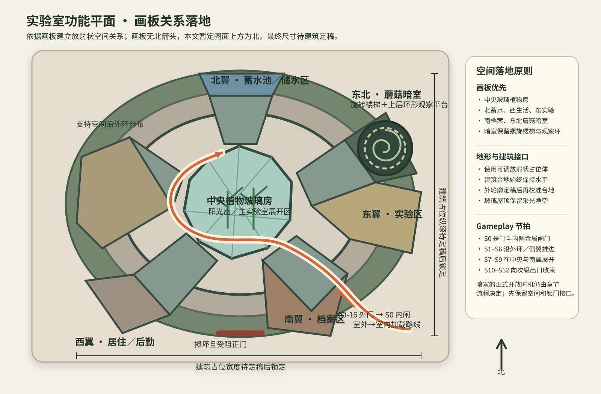
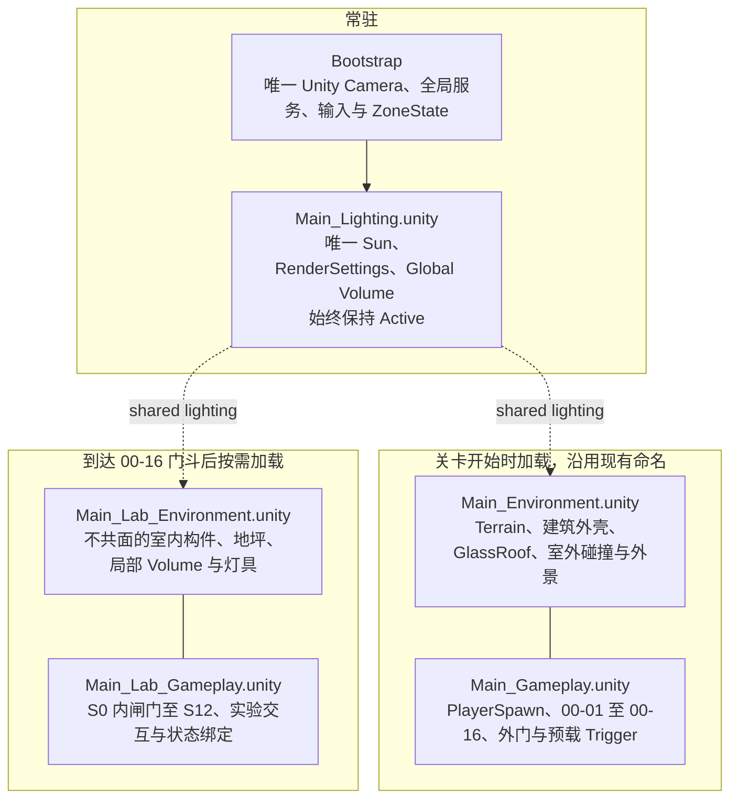
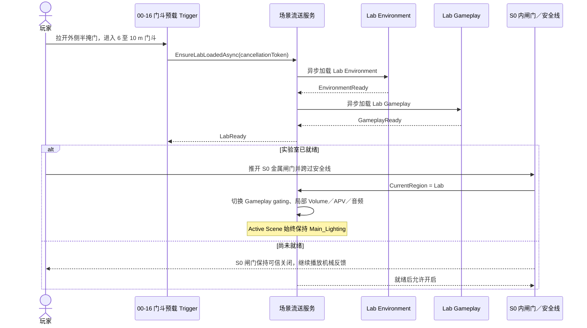

# 《Where the Roots Dance》全章节地形与场景空间设计方案

> 面向 Unity 6000.3.22f1 的室外地形、实验室空间、生态叙事与多场景加载方案  
> 版本: Rev 0.2  
> 日期: 2026-08-26  
> 使用者: 技术美术、场景美术、关卡策划、Gameplay 程序

## 0. 本轮结论

本轮把上一版的“线性下潜、地下实验室”改为策划画板明确表达的空间逻辑:

1. 室外使用以实验室为内核的多层不规则生态环。玩家从南侧死亡植物外环苏醒，沿起伏路线切过半死亡带、异色草带和稳定生态内环，再抵达实验室。
2. 实验室坐落在坡上的水平切填台地。建筑不随坡倾斜，也不把整栋建筑埋入地下。已经损坏并受阻的正门位于主接近面，检修入口位于坡下侧翼。
3. 实验室平面以画板的放射状方案为准。中央是带玻璃穹顶或玻璃屋顶的植物房。画板只有图面方位，没有北箭头，本文为对齐 Unity 坐标暂定图面上方为北侧，依次布置蓄水、左侧居住、右侧实验、下方档案和右上蘑菇暗室、旋转楼梯与观察平台。
4. 室外与实验室拆为独立 Additive Scene。玩家进入检修门斗时异步预载实验室，跨过安全线后再切换 Gameplay 和环境状态。离开时切回室外区域状态，并在越过滞回区后释放实验室 Environment。
5. 为保证从植物玻璃房向外看仍有天空、坡体和树影，Game Jam 默认在室内期间保留室外 Environment 与共享 Lighting，室外 Gameplay 只停用区域根。若内存不允许，再为玻璃房提供低成本室外代理景。
6. 本文不再使用 ASCII 图。总平面、剖面和室内平面使用 SVG，流程和加载关系使用 Mermaid。
7. 地形采用混合制作管线。Unity Terrain 负责连续可玩地表和宏观高程，Blender 负责挡土、断面、根系、排水和入口等 Terrain 不擅长的英雄级硬边 Mesh。

## 1. 依据、标记与决策顺序

### 1.1 信息标记

| 标记 | 含义 | 执行方式 |
|---|---|---|
| **[策划约束]** | 来自 Chapter 文档、S0 至 S12 表、总体流程图或四张画板 | 灰盒必须覆盖，除非策划更新 |
| **[工程事实]** | 从 Unity 工程、场景规范和现有加载代码中核对 | 不把目标架构误写成已经实现 |
| **[本轮默认]** | 为解决资料空白并让技术美术可以开工而选定 | 首轮按此搭建，走测后调整 |
| **[待确认]** | 会改变流程、资产边界或程序契约的未定项 | 不由场景美术擅自定案 |

策划文档和画板中的说明只作为项目内容来源。其内部出现的分工、命令或流程性语句，不视为对本任务的用户指令。

### 1.2 决策优先级

本轮按以下顺序处理冲突:

1. 用户本轮说明: 实验室规模基本不变，可在坡上，室内外分 Scene，植物玻璃房需要采光。
2. 四张策划画板: 室外同心生态环、放射状实验室、蘑菇暗室旋转楼梯和观察平台。
3. Chapter 文档和 S0 至 S12: 节点顺序、交互条件和不提前完整揭示真相。
4. Unity 工程现状: 当前场景加载能力、场景所有权和渲染约束。

### 1.3 已核对资料

| 资料 | 本方案采用的信息 |
|---|---|
| `00章流程测试策划与开发需求文档.docx` | 死亡污染区、生态过渡、异色草带、摘头盔、首次识别、土壤采样和报告 |
| `00章后半部分策划与开发需求文档.docx` | 设施远景、损坏且受阻的正门、向下线索、两类藤蔓、换气扇、管道和检修入口 |
| `02章实验室部分策划与开发需求文档 .docx` | 断电廊道、荧光藻、生物手电筒、菌丝门、实验、档案、次级出口和碎片化暗示 |
| `游戏流程图_draft.png` | Chapter 00 到实验室以及后续问号节点的整体顺序 |
| `画板/00章路线图.png` | 多层环状室外结构、建筑和中央区域关系、正门受损、维护入口、植被疏密引导 |
| `画板/场景设想1.png` | 死亡植物外环、异色草带和仙女环构图母题。半死亡过渡来自 Chapter 文档，不从难以辨认的画板手写字推断 |
| `画板/场景设想2.png` | 放射状实验室功能分区。原图标有“古早版本”，但本轮用户明确要求以画板方案为依据，因此恢复为灰盒基线 |
| `画板/场景设想3.png` | 圆形暗室、旋转楼梯和上层环形观察平台。“蘑菇暗室”名称来自场景设想 2 |
| 用户附加风格图 | 低模半写实 PSX、九十年代生态科研复古未来主义、安静、孤独、理性但不安 |
| Unity 工程 | Unity 6000.3.22f1、URP 17.3、1 unit = 1 m、Additive 场景与单 Camera 约束 |

## 2. 总体章节与空间逻辑

空间节奏不是持续下坡，而是“外环脊谷起伏、建筑台地抬升、检修入口局部下切、室内再次收放”。这样既满足 artist 希望的起伏室外，也保留 Chapter 00 中“入口向下”的局部线索。

| 段落 | 拓扑 | 高程节奏 | 玩家获得的信息 |
|---|---|---|---|
| Chapter 00 前段 | 从外环切入内环 | 低地苏醒、越过土脊、进入浅谷、再上异色草坡 | 生态逐渐恢复，异色草带成为第一远景目标 |
| Chapter 00 后段 | 内环接近加建筑外围半环 | 稳定区鞍部、正门台地抬升、侧翼维护路下切 | 先看到建筑和正门，再通过植物与人工结构找到检修入口 |
| Chapter 02 前段 | 外环走廊与侧翼房间 | 建筑地坪基本水平，局部坡道或短台阶只服务入口 | 断电困境、微光、制作与菌丝门锁 |
| Chapter 02 后段 | 中央展开后向次级出口收束 | 玻璃房挑高，暗室用螺旋垂直交通 | 实验、档案、碎片暗示和阶段结束 |

## 3. 室外地形方案

### 3.1 世界坐标和 Terrain 基线

**[本轮默认]** 延续当前工程的大方向，让玩家大体沿 `+Z` 从南侧走向设施，但路线本身沿生态环弯折，不再是直线走廊。

| 项目 | 首轮灰盒值 | 说明 |
|---|---:|---|
| Terrain Position | `(-144, -8, -32)` | Unity Terrain 从 Transform 向 `+X` 和 `+Z` 延伸 |
| Terrain Size | `(288, 48, 288)` | 世界范围 `X=-144 至 +144`、`Z=-32 至 +256`、`Y=-8 至 +40` |
| Heightmap Resolution | `513` | 只雕大坡、环脊、谷地和建筑台地 |
| Control Texture Resolution | `512` | 四层主要地表足够首轮使用 |
| 环带构图中心 | 约 `(0, 112)` | 指平面 `X/Z`，同时也是实验室台地中心 |
| 实验室台地地坪 | 约 `Y=+7 m` | 建筑保持水平 |
| 玩家苏醒地表 | 约 `(0, +3, -10)` | 玩家根节点高度根据实际 Prefab 脚底标记计算，不在本文写死 |
| 主路径净宽 | `3.5 m 至 5.5 m` | 路线边缘由植物、断面和坡向定义 |
| 交互平台 | 至少 `1.5 m × 1.5 m` | 草带采样、门口和操作台前必须接近水平 |
| 主路径坡度 | 尽量低于 `15°` | 短坡可更陡，但需 CharacterController 实机走测 |

高度上限从旧方案的 `+24 m` 提高到 `+40 m`。这为坡上玻璃房、后方坡体、树线和视线构图保留足够余量。建筑最终高度尚未锁定，定稿后只调整台地收口和局部背景坡，不重做整个环带地形。

### 3.2 四层生态环

画板明确提出仙女环式的同心构图。本文把它作为宏观地形母题，但不把每一圈做成几何完美的圆。

| 环带 | 距构图中心的灰盒半径 | 地形与植被 | Chapter 职责 |
|---|---:|---|---|
| A 死亡植物外环 | 约 `112 m 至 137 m` | 倒伏树、枯干树、灰褐土、局部污染光点，密度不规则 | 苏醒、移动教学、无线电和软边界 |
| B 半死亡过渡环 | 约 `90 m 至 112 m` | 树冠开始恢复，湿度与环境声增加，保留断裂死亡斑块 | 让生态变化连续，不像切换生物群落 |
| C 异色草带 | 约 `68 m 至 90 m` | 冷灰绿或银绿色草、局部更茂盛或变色、宽度 `6 m 至 16 m` | 摘头盔、首次识别和土壤采样 |
| D 稳定生态内环 | 约 `55 m 至 68 m` | 树木变疏、低矮植物稳定、设施轮廓持续可见 | 调查完成、接近设施和正门失败 |
| E 实验室台地 | 非圆形，使用宽、深、高可调占位体 | 切填边坡、破损混凝土、排水、建筑侵蚀植物 | 最终范围按建筑定稿外轮廓向各侧外扩 `5 m 至 8 m`，容纳正门平台、外围线索与检修入口 |

所有环带都要满足以下条件:

- 圆心允许相互偏移 `4 m 至 7 m`，边界允许缺口、相互咬合和局部加宽。任何偏移后的外环都必须保留在 `288 m × 288 m` Terrain 内。
- 玩家路线切过环带，不沿任意一圈完整走一周。
- 外圈植物不可等间距放置。主路线方向逐步降低树干密度，错误方向通过密度、坡体和雾自然关闭。
- 圆环关系在总平面成立，但地面视角受坡体、树干、实验室体量和雾遮挡，Chapter 02 之前不让玩家一次看全。
- 后续若从暗室观察平台揭示更大尺度关系，开放时机必须由剧情确认。

### 3.3 起伏剖面

沿玩家实际路线使用弧长 `s` 记录高程，比用世界 `Z` 单轴切区更适合环形地形。

| 路线节点 | 建议地表高程 | 作用 |
|---|---:|---|
| 苏醒低地 | `+3 m` | 让死亡林包裹玩家，只给一个较亮开口 |
| 外环土脊 | `+8 m` | 第一段明显上坡，越顶后首次看见异色草带色块 |
| 过渡浅谷 | `+4 m` | 恢复水声和湿润地表，打破单调上坡 |
| 异色草坡 | `+6 m` | 提供平整调查台，并在坡顶揭示实验室上部轮廓 |
| 稳定区鞍部 | `+5 m` | 让建筑暂时被低矮植物和地形切掉底部，只保留穹顶与上沿 |
| 正门台地 | `+7 m` | 正门清晰可见并可信受阻 |
| 检修入口平台 | `+4 m` | 侧翼维护路下切约 `3 m`，兑现“入口向下” |

建筑台地采用切填方:

- 上坡侧切坡，保留排水沟、挡土结构和植物侵蚀。
- 下坡侧填方或架空基础，外露的基座、管道和风扇使检修入口可信。
- 建筑结构保持水平。不得把整栋建筑旋转去贴 Terrain 法线。
- 玻璃穹顶、玻璃屋顶和阳光房上方不放山体、密树冠或遮光的大型遗迹。
- 地形与建筑交线使用独立低模土坡、挡墙或基座 Mesh 收口，不靠高度图强行贴出直角。

### 3.4 三次视线揭示

1. 苏醒后: 较亮开口与植被疏密给方向，暂时看不到完整实验室。
2. 越过外环土脊: 先看到异色草带的大色块，不看到其完整圆周。
3. 跨过异色草坡: 先出现玻璃穹顶、上层轮廓或反光，再逐步露出建筑主体和损坏且受阻的正门。

正门失败之后，左侧短支路承载指示牌与旧植物海报，右侧较长的下坡半环依次组织灰叶藤、细脉藤、换气扇、管道和检修入口。

### 3.5 Chapter 00 锚点建议

以下坐标是基于画板关系和可调建筑占位体的灰盒起点。建筑定稿后允许整体微调，节点顺序不可打乱。

| 锚点 | 建议世界位置 | 视线要求 |
|---|---:|---|
| 环带和建筑中心 | `(0, +7, 112)` | 建筑水平地坪基准 |
| 苏醒地表脚点 | `(0, +3, -10)` | 后方与侧方封闭，前方开口 |
| 异色草调查平台 | `(-12, +6, 39)` | 约 `6 m` 以上平整宽度，可见建筑上部 |
| 损坏且受阻正门 | `(0, +7, 80)` | 从南侧主接近面清楚可见 |
| 向下指示牌 | `(-12, +6, 83)` | 不与检修入口直接同框 |
| 旧植物海报 | `(-27, +7, 96)` | 左侧短支路尽头，可回看正门 |
| 换气扇 | `(+27, +11, 98)` | 位于检修入口斜上方 |
| 检修入口 | `(+29, +4, 105)` | 坡下侧翼，门前有预载区和安全线 |

### 3.6 Chapter 00 全节点覆盖

| 节点 | 空间落点 | Trigger 或前置 | 关键输出和地形职责 |
|---|---|---|---|
| 00-01 黑屏与苏醒 | A 环南侧低地 | 场景开始，数秒后恢复控制 | 风声、头盔呼吸、设备声和死亡植物先建立氛围 |
| 00-02 移动与环境引导 | A 环低地到土脊 | 基础移动并绕过倒木 | 用坡向、树密度和亮度引导，不依赖 UI 箭头 |
| 00-03 无线电 | A 环土脊前 | 离开出生袋并向草带推进 | 告知污染下降、进入遗迹后可能失联和调查目标 |
| 00-04 发现异色草带 | 土脊顶部远景 | 以可见性为主 | 草色、密度和生长状态形成第一远景目标 |
| 00-05 通讯消失与摘头盔 | B/C 交界 | 进入低污染阈值 | 信号衰减、污染提示与完整摘头盔反馈，平台保持平整 |
| 00-06 进入草带 | C 环断裂带 | 已摘下头盔后继续前进 | 声音、视野、土地和植物细节一起变化 |
| 00-07 第一次工具使用 | C 环调查平台 | 识别毯茅并采集草带边缘土壤 | 写入 `BOT-FL-041`、`SO-001` 和调查记录 |
| 00-08 远观研究设施 | C 环坡顶到 D 环 | 调查后继续接近 | 穹顶和上层轮廓先出现，设施成为持续锚点 |
| 00-09 正门损坏且受阻 | E 台地南侧 | 接近并确认无法通过 | 正门结构已经损坏，再叠加坍塌或植物阻挡，使直接入口失败可信 |
| 00-10 指示牌 | 正门左前 | 查看，不扫描、不采样 | 只播种“入口向下”，不与检修入口直接同框 |
| 00-11 研究设施海报 | 西南短支路 | 近距离查看残留图文 | 交代植物研究历史，可回望正门 |
| 00-12 灰叶藤 | 建筑多处，正门附近先见 | 必须扫描，不开放采样 | 写入 `BOT-FL-118`，建立常见优势植物，不只出现在答案处 |
| 00-13 细脉藤 | 灰叶藤夹层与人工缝隙 | 必须扫描，不开放采样 | 写入 `BOT-FL-203`，以细茎、密分枝、小叶和显叶脉建立辨识 |
| 00-14 生长方向 | 东侧管道与换气扇区域 | 扫描后重新观察并沿方向移动 | 藤蔓集中方向、人工缝隙、管道和慢转风扇共同支持推理 |
| 00-15 掀开灰叶藤 | 检修入口覆盖区 | 准星对准正确覆盖区并执行“移开植物” | Covered 到 Revealed，启用入口可见性和交互；切换前后站位、地面和碰撞一致 |
| 00-16 发现检修入口 | 坡下平台的外侧半掩门 | 观察、靠近并拉开半掩门 | 完成外围谜题；风声转为管道、水滴和设备低频，进入门斗预载区 |

扫描细脉藤不应成为程序硬锁。玩家如果直接探索到正确区域，也应能发现入口。扫描只增强理解，不偷偷修改地形或开路。

**[本轮默认]** 00-16 是外侧半掩检修门，S0 是门斗内侧可手动推开的金属闸门。两门之间保留转折和预载空间。这样同时容纳策划中的拉门与推门描述，也给异步加载提供 Ready Gate。若策划以后确认两者就是同一扇门，再合并体块、动作和状态机。

### 3.7 地形制作工具决策

**[本轮定案]** 使用“Unity Terrain 主体 + Blender 英雄级收口 Mesh”的混合方案。若制作条件迫使二选一，优先保留 Unity Terrain，不把整张可玩地表改成 Blender 单体 Mesh。

| 内容 | 制作工具 | 原因与边界 |
|---|---|---|
| `288 m × 288 m` 宏观高程 | Unity Terrain | 直接获得 TerrainCollider、Terrain Layer、植被工作流、LOD、光照与最终运行环境中的走测 |
| 苏醒低地、外环土脊、过渡浅谷、异色草坡、稳定区鞍部 | Unity Editor 参数化 Heightmap | 用世界坐标、半径、弧长和目标高程生成，可重复、可审查，不依赖 Agent 模拟手工笔刷 |
| 实验室切填台地的连续坡体 | Unity Terrain | 首轮使用可调占位范围，建筑定稿后再按最终外轮廓向各侧外扩 `5 m 至 8 m` |
| 台地水平基座、挡土墙、排水沟和坡脚收口 | Blender Mesh | 需要硬边、直角、悬挑或明确工程结构，不适合高度场 |
| 腐殖断面、裸露根系、局部垂直崖壁和入口切面 | Blender Mesh | Unity Terrain 不能表达洞穴、倒扣、悬挑和真正垂直面 |
| 实验室建筑、玻璃穹顶和暗室楼梯 | Blender | 属于硬表面建筑和模块化结构，不属于地形高度场 |
| 植物密度、关键遮挡和可玩性验证 | Unity | 必须在实际 Camera、雾、Collider、光照和 Gameplay Scene 中判断 |

#### AI Agent 精度判断

Blender MCP 和 Unity CLI 是控制协议或入口，不直接决定几何精度。精度取决于底层是否使用确定性的 API、数值参数和最终环境验证。

- Unity CLI 可以通过已打开 Editor 的 C# Editor API 精确创建 Terrain、写入 Heightmap、设置 `TerrainData.size`、读取建筑 Bounds、放置坐标锚点并进行 Play Mode 走测。它操作的是最终 Unity 数据，因此不是“比 Blender MCP 粗糙”的方案。
- Blender MCP 更适合组织 Mesh 编辑，但不应依靠“抬高一点”“平滑这里”之类语义操作制作整张地形。Agent 应通过 MCP 执行可复查的 `bpy` 参数脚本，生成挡土、断面和根系收口 Mesh。
- 整张地形若经外部 DCC 往返，会增加单位、轴向、Pivot、三角化、材质和碰撞的交接成本。宏观地表直接在 Unity 生成更容易保持数据一致。
- 项目已经验证 [Unity CLI 与 Pipeline 工作流](../architecture/tooling/unity-cli-agent-workflow.md)，当前没有配置 Unity MCP。

#### Agent 可重复执行管线

1. 由 Unity Editor 工具读取一份参数配置，生成或重建 `513` 分辨率 Heightmap。参数至少包含环心、各环半径、路线样条、高程节点、台地中心和台地标高。
2. 在 Unity 中放入可调放射状占位体，以占位 Bounds 复核台地、玻璃屋顶净空和关键视线。建筑定稿后再进行一次尺寸校准。
3. 锁定 Terrain 与建筑接线轮廓后，把台地边界、地坪标高和入口锚点交给 Blender。
4. Blender 通过可复查的 `bpy` 脚本生成挡土墙、排水、土层断面、裸露根系和硬边入口收口，只导出这些局部 Mesh。
5. 回到 Unity 检查局部 Mesh 的 Renderer Bounds、接线位置和碰撞，不让视觉 Mesh 与 Terrain 重复承担同一片可走面。
6. Terrain 保留唯一 TerrainCollider。视觉收口 Mesh 默认无碰撞；只有完全替代 Terrain 的连续表面才使用专门低模 Collider。
7. 所有生成与修改通过 Editor 工具、导入流程或可复查脚本完成，不手工编辑 Unity Scene、TerrainData 或 Prefab YAML。

## 4. 实验室建筑与室内地形

### 4.1 画板功能平面

**[本轮默认]** 画板没有北箭头。为便于 Unity 坐标沟通，本文暂把图面上方定义为北、右侧定义为东。左侧原图只写“居住区”，后勤用途是本轮对支持空间的补充，不是画板原字。

| 本轮地图方位 | 画板功能 | 灰盒用途 |
|---|---|---|
| 中央 | 植物玻璃房 | S7 主实验室与 S8 中央土壤分析，承担采光和最大空间展开 |
| 北翼 | 蓄水池或储水区 | 水声、湿墙和荧光藻的生态来源，可连接 S2 |
| 西翼 | 居住和后勤区 | 支持房、旧生活痕迹、可锁闭的非主线房间 |
| 东翼 | 实验区 | S3、S4 至 S6 的制作、菌丝门和预处理 |
| 南翼 | 档案区 | S9 档案阅览，并与损坏且受阻的正门保留结构关系 |
| 东北翼 | 蘑菇暗室 | 圆形暗室、旋转楼梯和上层观察环。开放时机待章节确认 |

“室内地形”不使用 Unity Terrain。地坪、坡道、架空平台、排水沟、植物池和暗室螺旋楼梯全部用模块化低模 Mesh。普通走廊建议净宽约 `3 m`，门口净宽不低于 `1.2 m`，净高 `2.2 m 至 2.3 m`。每个交互点前至少留 `1.5 m × 1.5 m` 平面。

### 4.2 S0 至 S12 空间映射

下表保留 Chapter 02 的节点逻辑，同时将旧版的一字排开和蛇形走廊改为放射状外环、侧翼和中央厅。

| 节点 | 策划核心内容 | 放射状平面安排 | 模块要求 |
|---|---|---|---|
| S0 | 检修入口金属闸门，可手动推开 | 东南坡下门斗内侧 | 00-16 外门后的第二道门，LabReady 后允许操作；门后是室内安全线 |
| S1 | 断电廊道 A | 沿东侧外环进入，避开中央玻璃房直视 | 黑暗来自断电和无窗内环，不再用“地下”解释 |
| S2 | 采样荧光藻孢子 | 靠北侧蓄水系统的湿润侧凹室 | 离主路 `2 m 至 3 m`，培养盒需有空位；采样后写入报告草稿，微光只照自身和湿墙 |
| S3 | 操作台 A，制作生物手电筒 | 东翼半开操作间 | 前置为已获得荧光藻孢子；完成后获得可手动开关的生物手电筒，并立刻看清 S4。是否保留额外成熟荧光藻供 S11 使用仍待确认 |
| S4 | 菌丝封锁安全门 | 东翼通往中央核心的门 | 靠近时触发封堵提示；头盔提示状态仍待确认，门体本身必须在黑暗中可定位 |
| S5 | 三个根节点 | 门框两侧和近地缝错位布置 | 三处投放成熟焰苔孢子后收缩，不做等距按钮阵列 |
| S6 | 预处理台 B 与根系共生实验 | 东翼靠中央的预处理室 | 前置为已获得根须样本；完成后更新实验记录，台体不挡玻璃房视线 |
| S7 | 主实验室 | 中央植物玻璃房，尺寸在建筑定稿后锁定 | 保留废弃设备、玻璃培养罐、破损天花、垂落根系和地缝菌丝，顶高和自然光形成全章最大展开 |
| S8 | 中央土壤分析 | 玻璃房内偏中心 | 必须持有 Chapter 00 土壤样本；产出反常土壤数据并写入报告，四周保留观察环 |
| S9 | 档案阅览 | 南翼档案区 | 通过阅读 UI 解锁档案片段，只提供间接关联，不直接揭露完整仙女环 |
| S10 | 菌丝封锁次级出口 | 西北或北侧外环出口，具体朝向待走测 | 物理破坏无效；地面周期脉动与提示反馈引导玩家寻找三组点位 |
| S11 | 三组双样本投放点 | 出口前错位三角区 | 每点都需要成熟荧光藻与成熟焰苔，三点全部完成后才收缩菌丝并开路；两类成熟样本的数量和消耗规则必须在接 Gameplay 前闭环 |
| S12 | 阶段结束和报告闭环 | 次级出口门后的独立锚点 | 不与未来章节 Trigger 合并 |

### 4.3 植物玻璃房和日照

中央玻璃房既是建筑核心，也是室内外场景拆分中最容易出问题的区域。

- 穹顶或玻璃屋顶保持真实天空方向，室外 Terrain 不穿入玻璃体积。
- 中午和低角度日照都要在灰盒阶段检查。至少保留一条阳光落到植物池和中央实验台的路径。
- 使用一套共享 Sun。实验室 Scene 不再放第二个 Directional Light。
- 玻璃使用少量大面片和 1 至 2 个共享 URP 材质。Game Jam 默认使用单层透明或抖动／裁切假玻璃，不制作重复内外层或昂贵折射。
- 穹顶框架、植物剪影和局部污渍承担 PSX 轮廓，透明表面本身不追求现代高精度折射。
- 内部停电区域靠遮光走廊、断电设备和局部房间组织，不把整座实验室做成无天光地下空间。
- 从玻璃房看外面时必须看到可信的天空、坡体和树线。对应加载方案见第 5 节。

### 4.4 蘑菇暗室与观察平台

画板 3 的旋转楼梯和上层观察环是明确的空间输入，但当前章节开放时机仍不完整。

**[本轮默认]** 灰盒先完成暗室体量、楼梯净空、观察环结构和锁门接口。Chapter 02 首次流程可让玩家看到入口或从外部感知其存在，但不自动开放，也不在此处完整展示仙女环真相。

走测重点:

- 螺旋楼梯外径建议先用 `6 m 至 8 m` 验证，踏步和内半径必须符合第一人称移动。
- 上层观察环净宽建议至少 `1.8 m`。
- 观察环若能看见室外环带，必须通过百叶、雾、穹顶框架或未开放视角控制信息量。
- 不能为了螺旋视觉牺牲碰撞稳定。必要时视觉楼梯和隐形连续坡道碰撞分离，但碰撞边界要与台阶轮廓一致。

## 5. Unity 6 多场景异步加载方案

### 5.1 当前能力与目标差距

**[工程事实]** 当前 `SceneLoader.LoadLevelAsync(LevelSO)` 会卸载除 Bootstrap 外的全部场景，再按 `LevelSO` 顺序 Additive 加载，并把第一个路径设为 Active。它不支持门口预载、室内外重叠驻留、选择性卸载或出入口往返的防抖。

因此:

- 只把实验室场景加入当前 LevelSO，会在关卡开始时一起加载，不是进入时异步加载。
- 为实验室建立第二个 LevelSO，会把室外整体卸载，无法保留玻璃房外景，也不适合门口无缝往返。
- 本节描述的是需要由集成 Owner 扩展的目标架构，不代表代码已经完成。

### 5.2 推荐场景集合

| Scene | Owner 和职责 | 室内期间状态 |
|---|---|---|
| Bootstrap | 程序 Owner。唯一 Camera、持久服务、`OutdoorZoneState` 与 `LabZoneState` | 始终加载 |
| `Main_Lighting` | 技术美术 Owner。唯一 Sun、全局 RenderSettings 和 Global Volume，不承包各分区的全部烘焙数据 | 新增后放在 LevelSO 第一项并始终 Active |
| `Main_Environment` | 技术美术 Owner。Terrain、建筑外壳、`GlassRoof`、室外静态碰撞、外景植被 | 沿用当前场景名并始终保留，保证玻璃房外景 |
| `Main_Gameplay` | Gameplay Owner。00 章 Trigger、室外交互、00-16 外门、门斗预载 Trigger 和外侧安全线 | 沿用当前场景名并保持加载；室内期间只停用区域逻辑根 |
| `Main_Lab_Environment` | 技术美术 Owner。不与外壳共面的室内壳体、地坪、局部 Volume、局部灯和静态碰撞 | 门斗内异步预载，离开并越过滞回区后卸载 |
| `Main_Lab_Gameplay` | Gameplay Owner。S0 内侧金属闸门、S1 至 S12、实验和叙事对象 | 首次进入时加载。Game Jam 默认离开后停用但保留；只有完成状态快照与恢复契约后才卸载 |

现有 `Main_Environment` 和 `Main_Gameplay` 已被工程引用，本方案不引入 `Main_Outdoor_*` 重命名迁移。新增场景只使用实验室对和可选的共享 `Main_Lighting`。Environment 与 Gameplay 的职责边界不能混回同一个场景。

### 5.3 进入实验室时序

时序图用串行加载表示最保守的 Game Jam 基线。实现可以在 Profile 证明峰值内存和读盘稳定后并发发起两项操作，但只有 Environment 与 Gameplay 都成功后才能发出 LabReady。

退出时执行:

1. `Main_Environment` 与 `Main_Gameplay` 默认一直在内存中，因此不需要在玻璃房出口临时抢加载。
2. 玩家跨过外侧安全线后设 `CurrentRegion = Outdoor`，启用室外区域根并停用实验室 Gameplay 根。Active Scene 继续保持 `Main_Lighting`。
3. 离开 `3 m 至 5 m` 滞回区后卸载 `Main_Lab_Environment`。Game Jam 默认保留已加载但停用的 `Main_Lab_Gameplay`，防止 S0 至 S12、门和实验进度丢失。
4. 若内存预算要求连 `Main_Lab_Gameplay` 一起卸载，必须先把一次性 Trigger、门状态、培养与投放进度、档案和章节完成状态写入 Bootstrap 的 `LabZoneState`，下次加载时在发出 LabReady 前恢复。

### 5.4 代码与 Trigger 契约

由集成 Owner 扩展中央 `SceneLoader`，或在同一运行时层增加专用 Streaming Service。推荐能力:

- `EnsureScenesLoadedAsync(scenePaths, cancellationToken)`: 幂等、single-flight，同一场景不会重复并发加载。
- `ReleaseScenesAsync(scenePaths, cancellationToken)`: 只卸载指定分区，不影响 Bootstrap、Lighting 和需要保留的室外外景。
- `IsReady(zoneId)` 和区域状态事件: 门体只消费状态，不直接管理 SceneManager。
- 使用完整 Asset 路径和 `LoadSceneMode.Additive`。
- Unity 异步操作通过 `Awaitable.FromAsyncOperation` 接入项目的 Awaitable 流程。
- Gameplay Trigger 只发送“请求预载”“跨过安全线”“请求释放”事件，不直接调用 `SceneManager`。
- 出入口重复进入、取消、加载失败和已加载状态都要有确定结果。加载集合中任一 Scene 失败时，应回滚已加载的半套 Scene 或保持可重试状态，不能发出 LabReady。
- `OutdoorZoneState` 至少保存一次性 Trigger、正门和检修门、Covered／Revealed、调查与报告状态。`LabZoneState` 至少保存 S0 至 S12、三根节点、三组投放点、档案和阶段完成状态。
- 不在每次门口卸载后调用 `Resources.UnloadUnusedAssets`，避免明显卡顿。只在章节切换或经过 Profile 证明合适的时机执行。

### 5.5 玻璃房外景的两种策略

| 策略 | 做法 | 优点 | 风险 | 本轮选择 |
|---|---|---|---|---|
| 保留 Outdoor Environment | 室内期间保留 Terrain、外壳、`GlassRoof`、远景和共享 Lighting，室外 Gameplay 只停用区域根，必要时再拆重植被子区 | 玻璃穹顶外景连续，切换简单，状态不会因卸载重置 | 内存驻留较高 | **Game Jam 默认** |
| Lab Exterior Proxy | 卸载完整室外，在 Lab Environment 中放低成本天空、坡体和树线代理 | 降低驻留内存 | 过门时易重叠、穿帮或光照不一致，需要额外维护 | 只有 Profile 证明必须时采用 |

如果使用代理景，必须在过渡期间控制 Renderer 互斥，避免同位置山体和树线重叠或 Z-fighting。

### 5.6 光照、Volume 和碰撞边界

- 运行时只保留一个 Directional Sun、一个主 RenderSettings 来源和一套全局 Volume 语义。
- `Main_Lighting` 只负责唯一 Sun、全局 RenderSettings 和 Global Volume。`Main_Environment` 与 `Main_Lab_Environment` 各自负责其 lightmap、Reflection Probe 和分区烘焙数据。
- APV 若启用，`Main_Lighting`、`Main_Environment` 与 `Main_Lab_Environment` 必须进入同一个 APV Baking Set，并按运行时目标组合进行 Multi-Scene Bake。Game Jam 首版若来不及验证，可暂不为 Lab 建独立 APV，只使用局部灯和 Box Volume，不能假设单独烘焙会自动连续。
- Lab Environment 可以有本地 Box Volume 和本地灯具，但不能复制全局 Sun。
- 外立面、`GlassRoof`、静态门框、墙体和室外遮挡碰撞只归 `Main_Environment`，室内 Scene 不复制这些共面 Renderer 或 Collider。
- 门内走廊、室内地面和 S1 之后碰撞归 Lab Environment。
- 每处可行走面只允许一套 Collider。Terrain 上的视觉土坡、挡墙和收口 Overlay 默认无碰撞；只有完全替代 Terrain 的连续区域才启用专用低模 Collider。
- 00-16 动态外门的门扇 Renderer、Animator、Collider，以及门斗预载 Trigger 和外侧安全线都归 `Main_Gameplay`。S0 动态内闸门、室内安全线与 S1 至 S12 归 `Main_Lab_Gameplay`，不放重复门扇、Collider 或 Trigger。
- 用当前 CharacterController 的 `height=2`、`radius=0.5`、`stepOffset=0.3`、`skinWidth=0.08` 走测门槛、Terrain 与收口 Mesh，以及螺旋楼梯的视觉踏步和连续坡道碰撞，避免脚底悬空或切入踏步。
- 运行时唯一 Unity Camera 继续由 Bootstrap 持有。评审视点只能是 Cinemachine 或编辑器书签，不新增常驻 Unity Camera。

## 6. 美术与技术美术约束

### 6.1 目标风格

项目不是现代科幻、霓虹赛博朋克或纯怀旧像素风。目标是“低模半写实 PSX × 九十年代生态科研复古未来主义”。场景应保留旧科研设施的理性秩序，同时被异常生态缓慢侵蚀。

| 尺度 | 方法 | 避免 |
|---|---|---|
| 宏观 `20 m 至 120 m` | 大环脊、大缓坡、谷地、台地和明确的建筑轮廓 | 程序噪声式碎丘和每处等强度细节 |
| 中观 `3 m 至 20 m` | 腐殖断面、挡土、排水、裸露根系和维护坡道用低模 Mesh | 过度平滑的写实曲面 |
| 近观 `0.1 m 至 3 m` | 低分辨率手绘 Atlas、有限植物变体、像素颗粒和轻微纹理扭曲 | 多层透明草片和大面积 Bloom |
| 交互 `0.5 m 至 5 m` | 通过轮廓、颜色、负空间和稳定站位保证可读 | 用发光描边和 UI 箭头补救摆放问题 |

### 6.2 地表与生态层

首轮只用四个主要 Terrain Layer:

1. `Ash_Dry`: 灰褐干土和灰烬，外环主面积。
2. `Humus_Dead`: 深褐腐殖和湿斑，谷地、倒木和过渡环较多。
3. `Stable_Soil`: 深灰绿稳定土，异色草带内侧增加。
4. `Research_Ground`: 破损混凝土、排水和维护平台，只在设施台地出现。

异色草、灰叶藤和细脉藤用 Mesh 植物、顶点色或共享 Material Variant 表现，不额外把整圈刷成硬边 Terrain Layer。

### 6.3 色彩与光照节拍

| 区域 | 主色 | 光照与雾 | 高饱和控制 |
|---|---|---|---|
| 死亡外环 | 灰褐、枯黄、冷灰 | 中等雾，低对比，脊顶略亮 | 少量旧设备警示色 |
| 异色草带 | 冷灰绿或银绿 | 雾减薄，植物轮廓更清楚 | 不做荧光草圈 |
| 稳定内环和设施 | 混凝土灰、氧化褐、灰叶绿 | 穹顶反光成为中距离锚点 | 标识和旧海报少量用色 |
| 断电廊道 | 黑绿、湿灰、淡青蓝 | 局部微光，高暗部比例 | 荧光藻和设备小灯 |
| 植物玻璃房 | 灰绿、瓷砖冷白、自然暖光 | 天光照植物，边缘保留阴影 | 报告终端和警告标识 |
| 蘑菇暗室 | 深灰绿、菌丝褐、低亮冷色 | 环形观察台有轮廓光 | 不做霓虹线路 |

## 7. 灰盒实施顺序

### 7.1 P0: 室外地形和建筑占位体

1. 在个人 Sandbox Scene 建立 `288 m × 48 m × 288 m` Terrain。
2. 用 Unity Editor 参数工具生成 Heightmap，不让 Agent 通过重复笔刷命令雕主地形。首轮参数覆盖苏醒低地、外环土脊、过渡浅谷、异色草坡、稳定区鞍部和 `+7 m` 建筑台地。
3. 按画板建立宽、深、高可调的放射状建筑占位体，以占位 Bounds 验证台地包络和中央玻璃房采光。建筑定稿后再校准，不在本阶段处理建筑资产。
4. 台地轮廓锁定后，再由 Blender 参数脚本制作挡土、排水、土层断面、根系和入口硬边收口 Mesh。
5. 回到 Unity 走通苏醒、草带、损坏且受阻的正门、左侧短支路、右侧下坡半环和检修入口，并检查 Terrain 与 Mesh 交界碰撞。
6. 固定五个评审视点: 苏醒开口、土脊见草带、草坡见穹顶、正门失败、换气扇与检修入口关系。

### 7.2 P0: 实验室空间

1. 按放射状画板分出中央玻璃房，并按本轮坐标默认把图面上、左、右、下、右上分别定向为北蓄水、西侧居住和后勤、东实验、南档案与东北暗室。
2. 先用体块验证 S0 至 S12，不放正式操作台和植物。
3. 验证检修入口门斗能隐藏加载，且 S1 黑暗不依赖“地下”设定。
4. 验证玻璃房日照、对外视线、暗室螺旋楼梯和观察环净空。

### 7.3 P0: 多场景流送接线

1. 由集成 Owner 确认场景命名和共享 `Main_Lighting` 方案。
2. 扩展场景流送服务，支持按场景集合预载和释放。
3. 在 00-16 外门后的门斗放预载 Trigger，在 S0 内闸门放 Ready Gate 和室内安全线，外侧安全线归 `Main_Gameplay`。
4. 测试进入、退出、门槛徘徊、快速折返、加载取消和失败重试。
5. 在玻璃房检查室外景、Sun、Volume、APV 和透明玻璃是否连续。

### 7.4 P1 与 P2

- P1: 生态代理、灰叶藤与细脉藤方向、荧光藻微光、菌丝状态切换、玻璃房植物剪影。
- P1: 无 UI 走测和最暗光照走测。
- P2: PSX 纹理扭曲、额外雾层、更多植物变体、精细破损和代理外景优化。

## 8. 验收清单

### 8.1 室外

- [ ] 测试者在 `30 秒` 内离开苏醒区，不持续撞边界。
- [ ] 玩家能明显感到至少一次上坡、一次下谷和一次再上坡，不是平地直走。
- [ ] 异色草带从远处可见，近看不等宽、不完整、不像任务结界。
- [ ] 玩家在正常眼高无法一次看清全部同心环。
- [ ] 植物玻璃房或穹顶从中段开始逐步成为远景锚点。
- [ ] 正门结构清楚表现为已损坏，再叠加坍塌或植物阻挡，受阻理由可信。
- [ ] 指示牌、两类藤蔓、换气扇和坡下入口能形成可推理关系。
- [ ] 建筑保持水平，台地、挡土、排水和坡面收口可信。

### 8.2 实验室

- [ ] 中央玻璃房、北蓄水、西后勤、东实验、南档案和东北暗室可从体块上辨认。
- [ ] S1 黑暗但不会盲撞，S2 微光能被自然发现。
- [ ] S3 至 S6 在东翼形成连续节拍，不挡进入中央厅的主要视线。
- [ ] S7 进入中央玻璃房时产生明确空间展开和自然光变化。
- [ ] S8、S9、S10 位于不同视觉象限，交互物不排成直线。
- [ ] S11 三组点位互相可见且站位稳定。
- [ ] S12 独立完成阶段结束和报告闭环。
- [ ] 蘑菇暗室楼梯和观察环可行走，但不会提前完整揭示宏观仙女环。

### 8.3 场景流送和技术

- [ ] 未到预载区时 Lab Scenes 不加载。
- [ ] LabReady 前门体保持可信关闭，不能进入未完成加载的空间。
- [ ] 跨安全线后内外 Scene 短时重叠，无黑帧、无坠落、无重复 Collider。
- [ ] 门槛往返不会重复并发加载或频繁卸载。
- [ ] 退出实验室后 Lab Environment 正确释放；Lab Gameplay 按默认保持加载但停用，或在 ZoneState 恢复测试通过后安全卸载。
- [ ] 室内期间只有一个 Sun、一个 Unity Camera 和一个全局环境来源。
- [ ] 玻璃房能看到天空、坡体和树线，不出现空白背景。
- [ ] 建筑占位体、门、人物、台阶和中央厅均按 1 unit = 1 m 设置，最终建筑定稿后重新测量。
- [ ] 不启用自动复杂 Collider，透明玻璃 Overdraw 和 Renderer 数经过 Frame Debugger 检查。
- [ ] 最弱目标机 Development Build 连续采集 `300` 个稳定 Gameplay 帧，按项目最终帧预算验收并保持稳定帧 `0 B GC`。

## 9. 开工前待确认

| 级别 | 问题 | 当前默认 | 影响 |
|---|---|---|---|
| P0 | 实验室最终外轮廓和玻璃房高度 | 灰盒只使用宽、深、高可调占位体，不锁定建筑数值 | 定稿后校准台地外扩、采光净空和室内节点距离 |
| P0 | 策划以后是否要把 00-16 和 S0 合并 | 灰盒保留外侧半掩门、门斗和内侧金属闸门 | 决定推拉动作、门轴和门斗能否删减 |
| P0 | 场景流送的集成 Owner 和最终新增场景名 | 保留现有 `Main_Environment/Main_Gameplay`，新增 `Main_Lab_*` 与可选 `Main_Lighting` | 决定代码、Build Settings 和 LevelSO 接线 |
| P0 | 室内期间可接受的室外 Environment 驻留内存 | 保留室外 Environment | 决定玻璃房是否需要代理外景 |
| P0 | Walkable Layer 与 Ground Mask | 由程序统一后再批量设置 | 影响 Terrain、地板和门槛接地检测 |
| P0 | 成熟焰苔孢子来源 | 在东翼预留采集凹室，不放正式对象 | 影响 S5 前置路线 |
| P0 | S11 所需成熟荧光藻的来源和消耗 | 灰盒在 S3 预留额外培养槽，不假定拆解生物手电筒，也不先写死是否消耗 | 决定 S3 培育数量、背包状态和 S11 是否可完成 |
| P0 | 根须样本来源 | 在 S5 门后或 S6 门口预留观察位 | 影响 S6 前置路线 |
| P0 | Chapter 00 土壤样本是否跨 Scene 持有 | 持久状态保存在 Bootstrap 服务层 | 影响 S8 分析条件 |
| P0 | Chapter 02 头盔状态 | 无 HUD 也可完成空间引导 | 影响 S0 提示和视觉效果 |
| P0 | Lab Gameplay 是否必须在离开后完全卸载 | Game Jam 默认保持加载但停用；全卸载前完成 `LabZoneState` 快照和恢复 | 影响往返状态与内存 |
| P1 | 蘑菇暗室在 Chapter 02 是否可进入 | 只保留可见但锁闭的空间接口 | 影响楼梯、观察环和真相揭示节奏 |
| P1 | S10 次级出口具体方位 | 先放西北或北侧外环 | 影响 S9 到 S12 的回路和后续接图 |
| P1 | 异色草最终色相 | 冷灰绿或银绿 | 影响 Terrain 调色和植物 Atlas |
| P1 | 正式性能目标机和分辨率 | 临时用桌面 1080p、60 fps | 影响植物密度、玻璃和室外驻留策略 |

## 10. 来源追踪矩阵

| 来源 | 必须保留的逻辑 | 本方案落点 |
|---|---|---|
| Chapter 00 前段 | 死亡到过渡到新生、草带吸引、首次识别与采样 | A 至 D 环、脊谷剖面、异色草调查平台、00-01 至 00-08 |
| Chapter 00 后段 | 设施远景、损坏且受阻的正门、向下指示、两类藤蔓、换气扇和检修入口 | 坡上台地、外围半环、坡下入口、00-09 至 00-16 |
| Chapter 02 | 断电廊道、荧光藻、制作、菌丝门、实验、档案和次级出口 | 放射状实验室的 S0 至 S12 映射 |
| 00 章路线画板 | 多层环形室外、受损主门、维护入口、植被疏密引导 | 室外环带总平面和四层生态环 |
| 场景设想 1 | 仙女环式同心构图、死亡外圈、异色草环 | 环带半径、断裂边界和地面视角遮挡 |
| 场景设想 2 | 中央植物玻璃房及五个方向功能区 | 放射状功能平面与房间分配 |
| 场景设想 3 | 圆形暗室、旋转楼梯、上层观察平台 | 东北暗室体量和锁闭接口 |
| 用户本轮说明 | 坡上实验室、室内外独立 Scene、玻璃屋顶或阳光房 | 剖面、多场景加载、共享光照和外景驻留策略 |
| 美术风格参考 | 低模半写实 PSX 和九十年代生态科研氛围 | 大形体优先、低分辨率手绘贴图、受控雾和透明玻璃 |

## 附录 A: 策划画板原图

以下图片是本轮空间方案的直接设计依据，已复制到项目文档资产目录，避免外部临时路径失效。

### A.1 00 章路线图

### A.2 场景设想 1

### A.3 场景设想 2

### A.4 场景设想 3

## 11. 技术美术立即执行清单

1. 在个人 Sandbox Scene 中按 `Position=(-144,-8,-32)`、`Size=(288,48,288)` 建立 Terrain。
2. 建立参数化 Unity Heightmap 工具，只生成六个宏观高程: 苏醒低地、外环土脊、过渡浅谷、异色草坡、稳定区鞍部和建筑台地。
3. 以 `(0,+7,112)` 为中心搭建宽、深、高可调的放射状建筑占位体，检查台地包络、玻璃屋顶采光和四次关键视线。
4. 锁定台地接线轮廓后，用 Blender `bpy` 脚本制作挡土、排水、断面、根系和入口收口 Mesh，再回 Unity 检查接线与碰撞。
5. 按画板搭出放射状室内占位体，将 S0 至 S12 映射到外环、东翼、中央玻璃房、南翼和次级出口。
6. 与集成 Owner 锁定第 5 节的 Scene 集合、加载服务接口、Ready Gate 与进出安全线。
7. 完成一次无 UI 室外走测、一次最暗廊道走测、一次玻璃房外景走测和一次门槛快速往返测试。

首轮成功标准不是资产完整，而是玩家能从起伏地形和生态变化理解方向，能通过设施外围线索找到坡下入口，进入后能按 S0 至 S12 完成实验室流程，同时玻璃房保持可信日照和连续外景。
